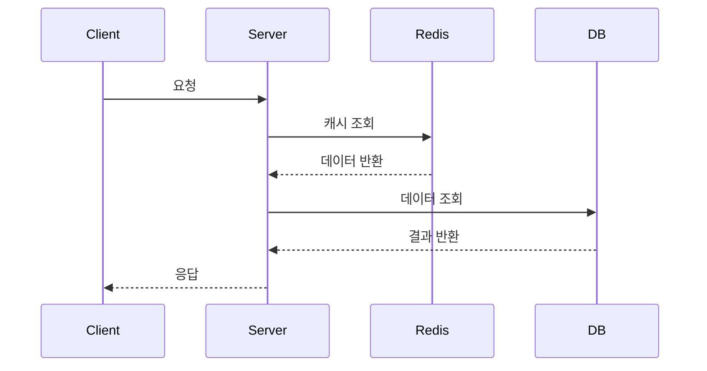
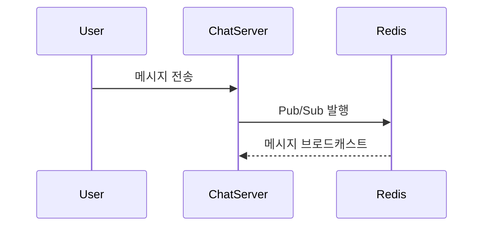

# 🖥️ 구매자 / 판매자 서버

> 서버 역할 한 줄 소개 작성

<br>

---

# 1. 📌 서버 개요

## 🔥 서버 소개

서버 소개 작성

<br>

---

# 2. 📡 주요 API

| Method | URI | Description |
|---|---|---|
| GET | /api/example | 예시 조회 API |
| POST | /api/example | 예시 생성 API |
| PUT | /api/example/{id} | 예시 수정 API |
| DELETE | /api/example/{id} | 예시 삭제 API |

<br>

## 📌 Swagger

```md
Swagger URL 작성
```

<br>

---

# 3. 🔄 서비스 플로우

## 📌 기능 플로우



<br>

## 📌 실시간 처리 플로우



<br>

---

# 4. 🗂️ ERD

## 📌 ERD Diagram

ERD 이미지 첨부

```md

```

<br>

---

# 5. 🧠 기술적 의사 결정

## 📌 ~~ 선택 이유

### ❓ 문제

문제 내용 작성

### 🔍 원인

원인 내용 작성

### ✅ 해결

해결 내용 작성

### 🎯 결과

결과 내용 작성

<br>

---

## 📌 ~~ 분리 이유

### ❓ 문제

문제 내용 작성

### 🔍 원인

원인 내용 작성

### ✅ 해결

해결 내용 작성

### 🎯 결과

결과 내용 작성

<br>

---

# 6. 🚨 트러블 슈팅

## 📌 메시지 유실 문제

### ❓ 문제

문제 내용 작성

### 🔍 원인

원인 내용 작성

### ✅ 해결

해결 내용 작성

### 🎯 결과

결과 내용 작성

<br>

---

## 📌 성능 저하 문제

### ❓ 문제

문제 내용 작성

### 🔍 원인

원인 내용 작성

### ✅ 해결

해결 내용 작성

### 🎯 결과

결과 내용 작성

<br>