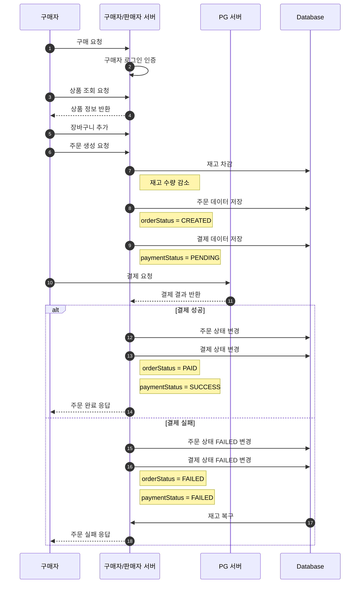
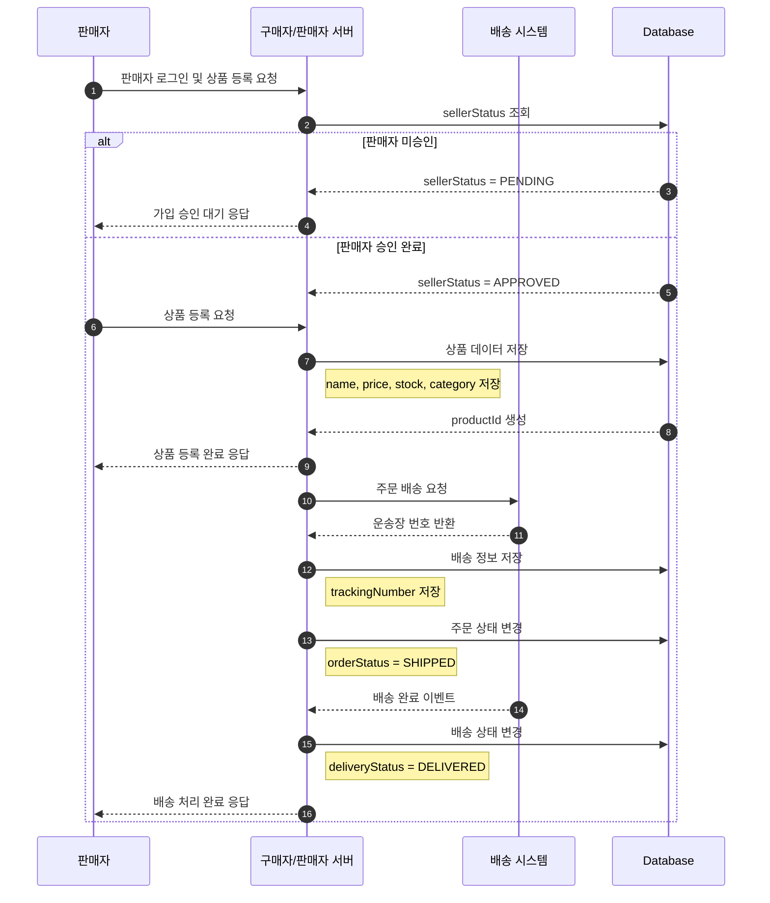
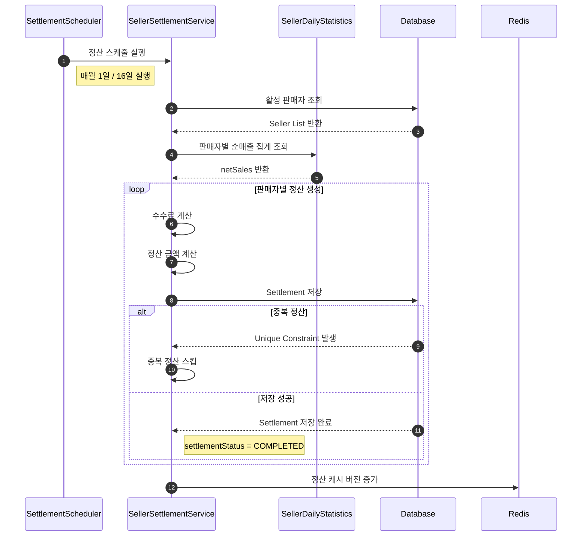
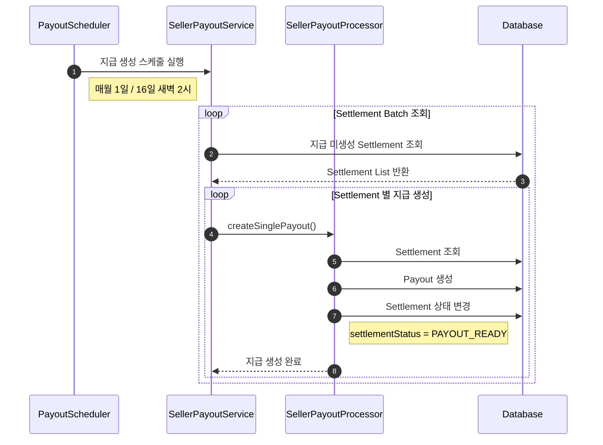
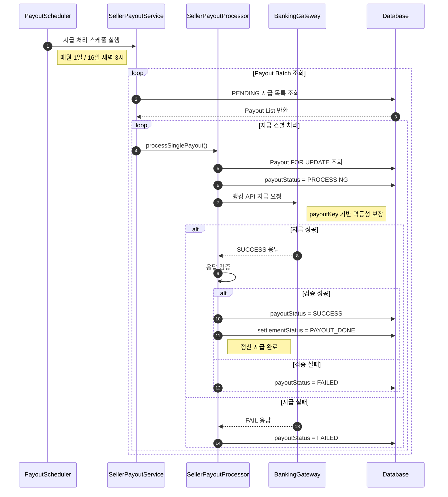
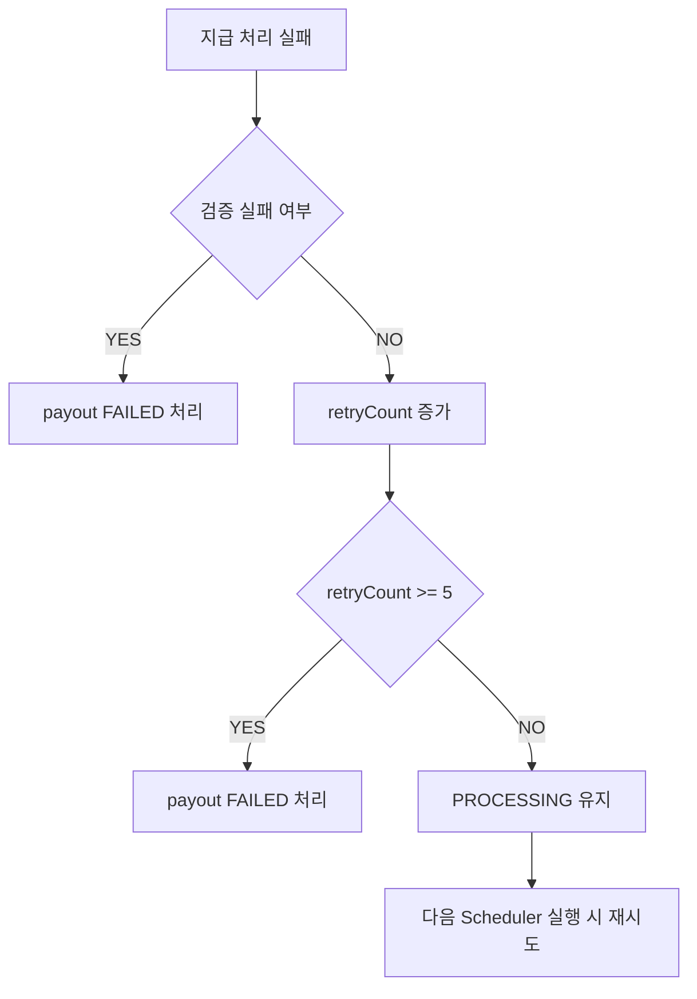
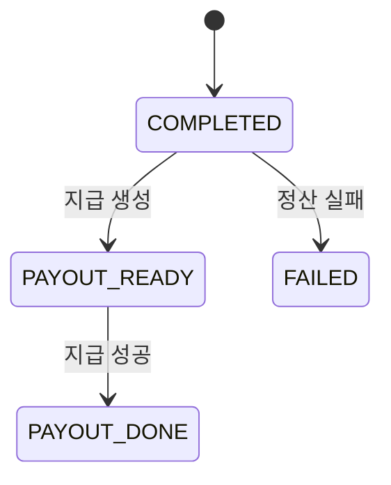
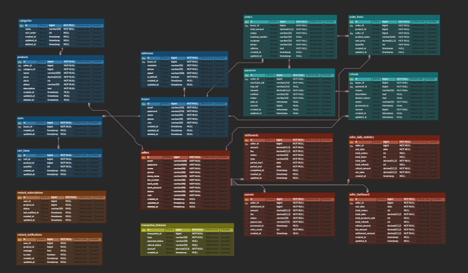

# 🖥️ 구매자 / 판매자 서버

## 포트폴리오 요약

`all-in-market`은 구매자/판매자 도메인을 분리한 멀티 벤더 이커머스 백엔드 프로젝트입니다.

### 핵심 기술 스택

| 영역 | 기술 |
|---|---|
| Language / Framework | Java 21, Spring Boot 4, Spring MVC, Spring Security |
| Persistence | Spring Data JPA, Querydsl, PostgreSQL, Flyway |
| Cache / Lock | Redis, Redisson |
| Auth / Security | JWT, Refresh Token Rotation, Redis blacklist, Login rate limit |
| Docs / Test | JUnit 5, Mockito, Spring REST Docs, Asciidoctor |
| Observability / Infra | Actuator, Micrometer, Prometheus, CloudWatch, Grafana, Terraform, k6 |

### 아키텍처 경계

- `buyer/**`: 구매자 API, 장바구니, 주문, 결제, 환불, 재입고 알림 흐름
- `seller/**`: 판매자 API, 상품, 대시보드, 통계, 정산, 지급 흐름
- `domain/**`: JPA 엔티티, Repository, 도메인별 DTO/집계 로직
- `common/**`: 공통 응답, 예외, 보안, Redis, scheduler, outbox, 설정
- `docs/asciidoc/**`: Spring REST Docs 기반 API 문서
- `infra/**`, `infra-grafana/**`, `k6/**`: 배포, 관측성, 부하 테스트 자산

### 주요 API

| 구분  | 대표 API                                                                                                   |
|-----|----------------------------------------------------------------------------------------------------------|
| 구매자 | `GET /products`, `POST /carts/items`, `POST /orders`, `POST /payments`, `POST /orders/{orderId}/refunds` |
| 판매자 | `POST /seller/products`, `GET /seller/dashboard`, `GET /seller/statistics/summary`, `GET /seller/settlements` |
| 인증  | `POST /auth/login`, `POST /auth/refresh`, `POST /seller/auth/login`, `POST /seller/auth/refresh`         |

### 실행 및 검증

```bash
# 전체 테스트
./gradlew test

# REST Docs 생성
./gradlew asciidoctor

# 애플리케이션 실행
./gradlew bootRun

# k6 시나리오 실행은 로컬 인프라 준비 후 수행
docker compose -f docker-compose-k6.yml up --abort-on-container-exit
```

필수 환경변수 예시는 `DB_PASSWORD`, `JWT_SECRET`, `SELLER_ID`, `SELLER_PASSWORD`, `SERVER_SECRET_KEY`입니다. 로컬 실행 시 PostgreSQL, Redis 등 외부 의존성이 필요합니다.

## 핵심 기술 결정

### 1. 로그인 API 보호: WAF + Redis rate limit

- Problem: 로그인 실패 사유와 반복 요청이 계정 추론, brute force, 서버 부하로 이어질 수 있었습니다.
- Cause: 인프라 레벨 차단만으로는 계정 단위 공격을 막기 어렵고, 애플리케이션 레벨만으로는 대량 트래픽을 서버가 먼저 받아야 했습니다.
- Solution: AWS WAF로 대량 요청을 1차 차단하고, Spring `LoginRateLimitFilter`에서 IP+email, email 단위 Redis 카운터를 적용했습니다.
- Result: 로그인 실패 사유를 통일하고, 8KB 초과 본문 차단과 이메일 해싱 저장으로 공격 표면을 줄였습니다.
- Lesson Learned: 보안 기능은 “차단 로직”뿐 아니라 proxy IP 신뢰 정책, Redis 장애 시 fail-open/fail-closed 선택, 테스트로 고정된 응답 정책까지 함께 설명해야 합니다.

### 2. 주문/결제 정합성: 상황별 동시성 전략

- Problem: 주문 생성, 재고 차감, 결제 승인, 환불은 중복 요청과 경쟁 상태가 바로 금전/재고 오류로 이어집니다.
- Cause: 모든 API에 같은 락을 적용하면 성능 비용이 크고, 반대로 애플리케이션 체크만 두면 동시성 조건에서 정합성을 보장하기 어렵습니다.
- Solution: 결제/환불은 DB 락과 유니크 제약을 활용하고, 재고 차감은 Redisson 분산락을 사용해 상품별 주문 생성을 직렬화하는 방향으로 설계했습니다.
- Result: 도메인별 충돌 비용에 따라 락 전략을 나눌 수 있었고, 결제 성공 유니크 인덱스와 outbox 저장처럼 DB 제약 기반 방어선을 일부 도입했습니다.
- Lesson Learned: 재고 차감 경로는 PostgreSQL 기반 동시성 테스트와 DB 차원의 보조 방어선이 아직 필요합니다. 이 항목은 known limitations와 개선 계획에 남겨 두었습니다.

### 3. 문서화 가능한 API 품질: REST Docs + 공통 응답

- Problem: 포트폴리오 API는 코드만으로는 요청/응답, 권한, 실패 케이스를 빠르게 이해하기 어렵습니다.
- Cause: 수동 API 문서는 코드 변경과 쉽게 어긋나고, 테스트 없는 문서는 신뢰도가 낮습니다.
- Solution: Controller slice test와 Spring REST Docs를 연결해 주요 buyer/seller API 문서 조각을 생성하고, `ApiResponse`와 `GlobalExceptionHandler`로 응답 형식을 통일했습니다.
- Result: API 문서는 `./gradlew asciidoctor`로 재생성할 수 있고, controller test가 문서의 기본 검증 역할을 합니다.
- Lesson Learned: 앞으로는 page size 제한, actuator 접근 정책, mock 결제 플로우 같은 운영 가정도 RestDocs/README에 함께 기록해야 문서가 더 설득력 있어집니다.

## 현재 한계와 개선 계획

| 한계 | 영향 | 개선 계획 |
|---|---|---|
| 재고 차감 경로의 DB 행 잠금/원자 업데이트 검증이 부족함 | Redis 락 외 장애/우회 상황에서 초과 판매 방어를 설명하기 어려움 | PostgreSQL 기반 동시성 테스트를 먼저 추가하고, DB pessimistic lock 또는 조건부 원자 업데이트를 검토 |
| 테스트 프로필이 Flyway를 끄고 H2 `create-drop`을 사용함 | PostgreSQL partial index, `pg_trgm`, 실제 migration 성공 여부가 테스트되지 않음 | Testcontainers PostgreSQL migration test 추가 |
| 상품 검색이 `%keyword%` LIKE 기반임 | 데이터가 커질수록 full scan 위험이 커짐 | products name/description trigram 또는 full-text index 적용 전후 `EXPLAIN ANALYZE` 문서화 |
| `/actuator/**`가 public permitAll이고 metrics/prometheus도 노출됨 | 운영 지표 노출 위험이 있음 | health와 prometheus 접근 정책 분리 또는 내부망/ALB 제한 근거 문서화 |
| `POST /payments`가 mock PG 확인까지 같은 요청에서 수행됨 | 실서비스 결제 생성/승인/webhook 경계와 다름 | README/API 문서에 mock flow임을 명시하고, 이후 confirm/webhook 분리 설계 |

<br>

---

# 1. 📌 서버 개요

## 서버 소개

구매자 / 판매자 및 상품, 결제, 주문 등 전반적인 서비스 기능을 담당 하는 서버

<br>

---

# 2. 📡 주요 API

| Method | URI                                | Description     | Role  |
|--------|------------------------------------|-----------------|-------|
| GET    | /products                          | 전체 상품 조회 API    | BUYER |
| POST   | /carts/items                       | 장바구니 상품 추가 API  | BUYER |
| POST   | /orders                            | 주문 생성 API       | BUYER |
| POST   | /payments                          | 결제 생성 API       | BUYER |
| POST   | /orders/{orderId}/refunds          | 환불 신청 API       | BUYER |
| POST   | /restock-subscriptions             | 재입고 알림 신청 API   | BUYER |
| DELETE | /restock-subscriptions/{productId} | 재입고 알림 취소 API   | BUYER |
| PUT    | /restock-notifications/me          | 알림 전체 읽음 처리 API | BUYER |

<br>

| Method | URI                             | Description        | Role   |
|--------|---------------------------------|--------------------|--------|
| POST   | /seller/products                | 상품 등록 API          | SELLER |
| GET    | /seller/dashboard               | 대시보드 조회 API        | SELLER |
| POST   | /seller/dashboard/refresh       | 대시보드 캐시 삭제 API     | SELLER |
| GET    | /seller/statistics/daily/{date} | 특정 날짜 통계 자료 조회 API | SELLER |
| GET    | /seller/statistics/summary      | 특정 기간 통계 자료 조회 API | SELLER |
| GET    | /seller/settlements             | 정산 전체 조회 API       | SELLER |

<br>

---

# 3. 🔄 서비스 플로우

<details>
<summary><h2>구매 플로우</h2></summary>


</details>

<br>

---

<details>
<summary><h2>판매 플로우</h2></summary>


</details>

<br>

---

<details>
<summary><h2>판매자 정산 생성 플로우</h2></summary>


</details>

<br>

---

<details>
<summary><h2>판매자 지급 생성 플로우</h2></summary>


</details>

<br>

---

<details>
<summary><h2>판매자 지급 처리 플로우</h2></summary>


</details>

<br>

---

<details>
<summary><h2>지급 재시도 전략</h2></summary>


</details>

<br>

---

<details>
<summary><h2>Settlement 상태 흐름</h2></summary>


</details>
<br>

---

# 4. 🗂️ ERD





<br>

---

# 5. 🧠 기술적 의사 결정

## WAF + Login Rate Limit Filter를 활용한 로그인 API 보안 강화

### 배경

현재 시스템은 로그인 실패 시 구체적인 사유(예: 존재하지 않는 계정, 비밀번호 불일치 등)를 노출하고 있어, 공격자가 유효한 계정 정보를 추론할 수 있는 단서를 제공하고 있었습니다.
또한, 특정 IP에서의 대규모 트래픽 공격이나 분산 IP를 이용한 무차별 대입 공격(Brute Force Attack)에 대한 방어 체계가 부재하여 인프라 및 애플리케이션 레벨의 보호 대책이 시급했습니다.

### 기술 선택지

로그인 API를 보호하기 위해 인프라 계층과 애플리케이션 계층을 모두 아우르는 다중 방어 전략을 검토했습니다.

|비교 항목|AWS WAF (Infra)|Redis 기반 Filter (App)|
|--------|---------------|----------------------|
|차단 위치|서버 도달 전 (엣지)|서버 도달 후 (Spring Boot)|
|차단 단위|IP 단위 (Rate-based)|IP, 계정, IP+계정 복합 차단|
|제어 정밀도|단순 트래픽 제한|비즈니스 로직 기반 세밀한 제한|
|주요 목적|대규모 DDoS 및 스캐닝 방어|무차별 대입 공격 및 계정 잠금|

### 선택 이유

- 다중 방어 계층(Defense in Depth) 구축: AWS WAF를 통해 서버 리소스를 소모하기 전 대규모 공격을 일차적으로 걸러내고,
  애플리케이션 내부 필터에서 비즈니스 로직(계정별 실패 횟수 등)에 기반한 정밀한 차단을 수행하도록 설계했습니다.

- 계정 정보 유출 방지: 실패 사유를 "로그인 실패"로 통일하여 공격자의 정보 추론을 원천 차단했습니다.

- 보안 가시성 및 유연성: Redis 카운터를 사용하여 동일 공격자가 IP를 변경하며 특정 계정을 공격하거나,
  한 네트워크 내에서 여러 계정을 공격하는 시나리오를 모두 방어할 수 있습니다.

### 해결 및 결과

1. 실패 사유 통일 및 로깅: 클라이언트에는 일관된 실패 메시지를 반환하되, 내부 로그에는 상세 사유를 기록하여 운영 모니터링은 유지했습니다.

2. AWS WAF 적용: 5분 이내 1,000번 이상의 요청이 발생하는 IP를 인프라 레벨에서 즉시 차단하여 서버 부하를 방지했습니다.

3. Redis 기반 중첩 차단 로직 구현:

    - IP + 계정: 5분 내 5회 실패 시 5분간 차단 (동일 공격자의 집중 공격 방어)

    - 계정 전용: 5분 내 10회 실패 시 5분간 차단 (IP 변조를 통한 분산 공격 방어)

4. 보안 취약점 보완:

    - X-Forwarded-For 스푸핑 방지: ALB의 동작 방식을 고려하여 헤더의 마지막 IP를 신뢰하도록 로직을 강화했습니다.

    - 대용량 페이로드 차단: 8KB 초과 요청 시 413 에러를 반환하여 메모리 고갈 공격을 방지했습니다.

    - 개인정보 보호: Redis 저장 시 이메일을 SHA-256으로 해싱하여 데이터 유출 시에도 개인정보를 보호했습니다.

5. 결과: 무차별 대입 공격에 대한 방어 성공률이 크게 향상되었으며, 비정상적인 로그인 시도로부터 시스템 리소스를 안전하게 보호할 수 있게 되었습니다.

<br>

---

## Refresh Token Rotation 및 Blacklist 도입을 통한 인증 보안 강화

### 배경

기존의 단순 JWT 인증 방식은 Access Token의 탈취 위험을 줄이기 위해 만료 시간을 짧게 설정하지만, 이로 인해 사용자가 자주 재로그인해야 하는 불편함(UX 저하)이 발생합니다.
이를 보완하기 위해 Refresh Token을 사용하지만, 이 역시 탈취될 경우 유효 기간 동안 공격자가 지속적으로 새로운 Access Token을 발급받을 수 있는 '무한 재발급'의 위험을 내포하고 있습니다.
특히 토큰 자체에 정보를 담지 않는 Opaque Token(UUID) 방식을 채택하고 있어, 서버 측에서 토큰의 오용 여부를 정밀하게 제어할 메커니즘이 절실했습니다.

### 기술 선택지

토큰 보안을 강화하기 위해 고려한 전략은 다음과 같습니다

| 비교 항목 | 옵션 1: 단순 Refresh Token    | 옵션 2: Refresh Token Rotation |
|-------|---------------------------|---------------------------|
| 재사용 정책 | 만료 전까지 동일 토큰 반복 사용        | 1회 사용 시 즉시 폐기 및 새 토큰 교체   |
| 탈취 대응 | 탈취 시 만료 전까지 공격자 이용 차단 불가  | 이미 사용된 토큰 유입 시 즉시 침해 탐지 가능|
| 로그아웃 제어 | 클라이언트 측 토큰 삭제에만 의존        | 서버 Redis에서 즉시 삭제 및 Blacklist 관리 |
| 보안 수준 | 보통 (토큰 유출 시 취약)           | 매우 높음 (재사용 및 탈취 공격 원천 차단) |

### 선택 이유

보안성과 사용자 편의성의 균형을 맞추기 위해 Refresh Token Rotation(RTR) 전략을 선택했습니다.

- 침해 탐지 능력: RTR은 토큰 사용 즉시 삭제되므로, 동일 토큰이 다시 유입된다는 것 자체가 탈취된 토큰의 재사용 시도로 간주되어 즉각적인 방어가 가능합니다.

- 원자적 무효화: Redis의 getAndDelete() 연산을 활용하여 조회와 삭제를 하나의 원자적(Atomic) 트랜잭션으로 처리함으로써 동시성 이슈를 해결했습니다.

- 중앙 집중식 세션 제어: user_refreshes:{userId} Set 구조를 통해 멀티 디바이스 로그아웃 및 특정 사용자의 전체 세션 강제 종료 기능을 확보했습니다.

### 해결 및 결과

1. RTR 아키텍처 구축:

    - Redis를 저장소로 활용하여 UUID 기반의 불투명 토큰(Opaque Token) 관리.

    - 토큰 재발급 요청 시 기존 토큰을 즉시 폐기하고 새로운 UUID 토큰을 발급하여 교체.

2. 보안 전송 체계 수립:

    - Refresh Token을 응답 바디가 아닌 HttpOnly, Secure, SameSite=Strict 옵션이 적용된 쿠키로만 전달하여 XSS 및 CSRF 공격을 이중으로 방어했습니다.

3. Blacklist 시스템 도입:

    - 로그아웃 시 사용 중인 Access Token을 Redis 블랙리스트에 등록하여, 토큰 유효 기간이 남아있더라도 즉시 무효화되도록 구현했습니다.

4. 결과:

    - 탈취 토큰 재사용 원천 차단: 한 번 사용된 토큰은 폐기되므로 공격자의 재사용이 불가능해졌습니다.

    - 세션 관리 기능 강화: 멀티 디바이스 로그인 추적 및 로그아웃 시 모든 기기의 연결을 일괄 종료할 수 있는 기능을 확보했습니다.

<br>

---

## Redis 보완형 JWT 인증 아키텍처 및 보안 강화

### 배경

JWT(JSON Web Token)는 서버의 상태를 유지하지 않는(Stateless) 장점이 있지만, "한 번 발급된 토큰은 만료 전까지 제어가 불가능하다"는 치명적인 단점이 있습니다.
이로 인해 로그아웃한 사용자가 여전히 시스템에 접근하거나, 탈취된 토큰을 즉시 차단할 수 없는 보안 취약점이 발생합니다.
또한, 계정 존재 여부를 응답 시간으로 유추하는 타이밍 공격(Timing Attack)이나 무차별 대입 공격(Brute-force)으로부터 시스템을 보호할 정교한 인증 구조가 필요했습니다.

### 기술 선택지

인증 시스템의 신뢰성을 높이기 위해 다음과 같은 보안 전략들을 결합했습니다.

|보안 위협|대응 기술 및 전략|비고|
|--------|--------------|---|
|토큰 제어 불가|Redis Blacklist 기반 강제 무효화|로그아웃 즉시 토큰 차단|
|무차별 대입 공격|Login Rate Limit Filter (Redis 기반)|IP당 실패 횟수 제한 (429 응답)|
|계정 열거 공격|Dummy BCrypt 연산 (Timing Attack 방어)|이메일 존재 여부 은닉|
|인프라 장애 우회|Fail-Closed 정책 적용|Redis 장애 시 인증 우회 대신 503 응답|

### 선택 이유

단순 JWT의 편리함보다 '서버의 통제권'과 '공격 방어 역량'을 우선순위에 두었습니다.

- Stateless의 한계 극복: Redis를 활용한 블랙리스트와 RTR(Rotation) 구조를 통해, 필요시 서버가 즉시 토큰을 무효화할 수 있는 'Stateful'한 제어력을 확보했습니다.

- 심층 방어(Defense in Depth): 인증 필터(JwtAuthenticationFilter) 실행 전 단계에서 속도 제한(Rate Limit)을 먼저 수행하여 불필요한 인증 연산과 DB 부하를 차단했습니다.

- 응답 시간 균등화: 판매자(Seller) 로그인 시 계정 존재 여부에 상관없이 동일한 암호화 연산 시간을 소요하게 하여, 응답 시간 차이를 이용한 계정 유추 공격을 원천 봉쇄했습니다.

### 해결 및 결과

1. 보안 필터 체인 최적화: LoginRateLimitFilter → JwtAuthenticationFilter 순으로 배치하여 효율적인 방어 체계를 구축했습니다.

2. 효율적인 블랙리스트 관리: 로그아웃 시 Access Token의 남은 유효 시간을 Redis TTL(Time To Live)로 설정하여, 메모리 누수를 방지하면서 실시간 무효화를 구현했습니다.

3. 타이밍 공격 방어 성공: 존재하지 않는 이메일로 로그인 시도 시에도 더미 BCrypt 연산을 수행하여, 공격자가 응답 시간으로 계정 유효성을 판단할 수 없게 했습니다.

4. 결과:

    - 확장성과 보안의 조화: Stateless한 JWT의 확장성을 유지하면서도 Redis를 통해 실시간 제어력을 확보했습니다.

    - 비즈니스 로직 보호: @PreAuthorize 및 SecurityUtils를 통해 컨트롤러 코드의 오염 없이 안전하게 사용자 권한을 검증할 수 있는 환경을 조성했습니다.

<br>

---

## 데이터 정합성을 위한 API별 차등 동시성 제어 전략 수립

### 배경

e-커머스 플랫폼 특성상 결제, 재고 차감, 환불 등 데이터 정합성이 극도로 중요한 도메인이 다수 존재합니다.
특히 사용자의 더블 클릭, 네트워크 재전송, 한정판 상품 출시와 같은 고부하 상황에서 경쟁 상태(Race Condition)가 발생할 경우
중복 결제나 재고 초과 판매 등의 심각한 비즈니스 오류로 이어질 위험이 있었습니다.

### 기술 선택지

동시성 문제를 해결하기 위해 인프라 비용과 시스템 복잡도를 고려하여 네 가지 단계를 검토했습니다.

| 제어 방식               |특징|장점|단점|
|---------------------|---|---|---|
| 멱등 키 + Unique 제약    |DB 제약 조건을 활용한 원자성 보장|성능 저하 없음, 구현 단순|비즈니스 로직 복합 제어 어려움|
| 낙관적 락 (Optimistic)  |@Version을 이용한 애플리케이션 레벨 제어|DB 커넥션 점유 시간 짧음|충돌 빈도 높을 시 재시도 비용 증가|
| 비관적 락 (Pessimistic) |SELECT FOR UPDATE를 이용한 배타적 잠금|강력한 정합성 보장|데드락 위험, 성능 저하 가능성|
| 분산 락 (Distributed)  |Redis(Redisson)를 이용한 분산 환경 락|DB 부하 감소, 타임아웃 제어 용이|별도 인프라(Redis) 의존성 발생|

### 선택 이유

모든 API에 동일한 락 전략을 적용하는 대신, 충돌 빈도와 재시도 비용을 기준으로 최적의 전략을 차등 적용했습니다.

- 비용 최소화: 멱등 키와 유니크 제약 조건을 최우선으로 고려하여 불필요한 락 오버헤드를 방지했습니다.

- 도메인 특성 고려: 충돌이 적은 승인 로직은 낙관적 락을, 정합성이 최우선인 결제/환불 로직은 비관적 락을 선택했습니다.

- 고부하 대응: 재고 차감처럼 트래픽이 몰리는 지점은 DB 부하를 분산시키기 위해 Redis 기반 분산 락을 도입했습니다.

### 해결 및 결과

1. 결제/환불 생성 (비관적 락):

    - 중복 요청은 멱등 키로 1차 차단하되, 서로 다른 클라이언트에서의 동시 접근 시 정합성이 최우선이므로 Pessimistic Write Lock을 통해 데이터 무결성을 보장했습니다.

2. 결제 승인 (낙관적 락):

    - 이미 생성된 데이터의 상태 변경이 주 작업이며 충돌 빈도가 낮으므로, 버전 관리(@Version)를 통해 DB 점유 시간을 최소화하고 시스템 처리량을 높였습니다.

3. 주문 생성/재고 차감 (분산 락):

    - 한정판 상품 구매 등 대규모 트래픽 집중 시 DB 락 경합으로 인한 성능 저하를 방지하기 위해 Redis 분산 락을 선제적으로 적용하여 DB 접근 자체를 제어했습니다.

4. 결과:

    - 데이터 정합성 확보: 중복 결제 및 초과 판매 이슈를 원천 차단했습니다.

    - 성능 최적화: 모든 요청에 무거운 락을 거는 대신 상황에 맞는 전략을 적용하여, 고부하 상황에서도 안정적인 응답 시간을 유지했습니다.

<br>

---

## Redis 기반 다각적 캐싱 전략을 통한 시스템 성능 최적화

### 배경

멀티 벤더 이커머스 플랫폼 특성상 상품 조회, 판매자 대시보드, 실시간 채팅 등 읽기 작업(Read-Heavy)이 전체 트래픽의 대부분을 차지합니다.
특히 인기 상품에 대한 반복적인 DB 접근과 대시보드의 복잡한 집계 쿼리(SUM, COUNT, GROUP BY)는
트래픽 증가 시 DB 부하를 가중시키고 응답 속도를 저하시키는 주요 원인이 되었습니다.

### 기술 선택지

조회 성능 개선과 서버 부하 분산을 위해 다음과 같은 전략을 검토했습니다.

|항목|옵션 1: Local Cache (Ehcache 등)| 옵션 2: Global Cache - Redis         |
|---|-------------------------------|------------------------------------|
|데이터 일관성|서버 인스턴스별 데이터가 달라 정합성 문제 발생| 모든 서버가 동일한 데이터를 참조하여 일관성 유지        |
|확장성|서버 대수가 늘어날수록 캐시 효율 저하| 분산 환경 및 확장(Scale-out)에 최적화         |
|추가 기능|단순 데이터 저장 위주| Pub/Sub, Atomic 연산 등 다양한 데이터 구조 지원 |
|메모리 자원|애플리케이션 힙(Heap) 메모리 공유| 별도 인프라 자원 사용으로 애플리케이션 안정성 확보       |

### 선택 이유

멀티 서버 환경(ECS Fargate)에서 데이터 일관성을 유지하고, 실시간 채팅 기능을 위한 Atomic 연산이 필요했기에 Redis를 선택했습니다.

- 낮은 지연 시간: In-Memory 구조를 통해 DB 대비 수십 배 빠른 응답 속도를 확보했습니다.

- 원자적(Atomic) 제어: 채팅 읽지 않은 메시지 수(Unread Count) 관리를 위해 동시성 이슈 없는 INCR/DECR 연산이 필요했습니다.

- 다양한 활용성: 단순 캐싱뿐만 아니라 메시지 브로커(Pub/Sub)로서의 역할까지 수행할 수 있어 기술 스택을 단순화할 수 있었습니다.

### 해결 및 결과

1. Cache Aside 전략 적용 (인기 상품 조회):

    - 요청 시 캐시를 먼저 확인하고, 미존재 시에만 DB를 조회하는 전략을 통해 인기 상품에 대한 반복적인 DB 접근을 80% 이상 절감했습니다.

2. 실시간 채팅 Unread 관리:

    - 빈번한 수정이 발생하는 읽지 않은 메시지 수를 DB UPDATE 대신 Redis의 INCR 연산으로 처리하여 DB Write 부하를 최소화했습니다.

3. 대시보드 사전 집계 캐싱:

    - 매 요청마다 발생하는 무거운 집계 쿼리를 스케줄러 기반의 사전 집계 로직으로 대체하고 결과를 Redis에 캐싱하여, 대시보드 진입 속도를 획기적으로 개선했습니다.

4. 결과:

    - 응답 시간 단축: 평균 API 응답 시간을 크게 개선하여 사용자 경험을 향상시켰습니다.

    - 인프라 안정성: DB 커넥션 점유율을 낮춤으로써 갑작스러운 트래픽 급증에도 시스템 전체가 다운되지 않는 탄력적인 아키텍처를 구축했습니다.

<br>

---

## Outbox 패턴 적용을 통한 결제 트랜잭션 분리 및 이벤트 정합성 확보

### 배경

주문 및 결제가 완료되면 판매자의 매출 통계를 관리하는 대시보드 업데이트가 수반되어야 합니다.
초기에는 결제 트랜잭션 내에서 대시보드 업데이트 로직을 직접 호출했으나, 통계 처리 로직의 복잡도로 인해 결제 응답 시간이 길어지고,
대시보드 서비스의 장애가 핵심 기능인 결제 성공 여부에 영향을 주는 강한 결합(Strong Coupling) 문제가 발생했습니다.

### 기술 선택지

결제와 대시보드 로직을 분리하고 데이터 정합성을 보장하기 위해 다음과 같은 방안을 검토했습니다.

|비교 항목|옵션 1: 단순 비동기 호출 (@Async)|옵션 2: Outbox 패턴|
|--------|-----------------------------|------------------|
|정합성 보장|트랜잭션 커밋 후 비동기 호출 실패 시 이벤트 유실 위험|결제 데이터와 이벤트가 동일 트랜잭션으로 묶여 유실 없음|
|장애 전파|방지 가능|완전 분리 (대시보드 장애가 결제에 영향 없음)|
|추적 및 복구|실패 시 로그 기반 수동 복구 필요|DB 상태(processed, retry_count) 기반 자동 재시도 가능|
|복잡도|매우 낮음|중간 (별도 테이블 및 스케줄러 구현 필요)|

### 선택 이유

단순히 속도를 높이는 것보다 '이벤트의 확실한 전달(At-least-once delivery)'과 '장애 격리'를 최우선으로 판단하여 Outbox 패턴을 선택했습니다.

- 트랜잭션 원자성: 결제 정보 저장과 이벤트 저장을 하나의 DB 트랜잭션으로 묶어, 결제가 성공했는데 통계가 누락되는 상황을 원천 차단했습니다.

- 신뢰할 수 있는 재시도: 애플리케이션 메모리가 아닌 DB에 이벤트 상태를 저장하므로, 서버가 다운되더라도 재기동 후 미처리된 이벤트를 추적하여 처리할 수 있습니다.

### 해결 및 결과

1. 이벤트 전용 테이블 구축: dashboard_outbox 테이블을 생성하여 이벤트 타입, 페이로드, 처리 여부(processed), 재시도 횟수 등을 관리하도록 설계했습니다.

2. Polling 스케줄러 구현:

    - 주기적으로 미처리 이벤트를 조회하여 대시보드를 갱신하는 워커를 구현했습니다.

    - 비관적 락(FOR UPDATE) 기반 조회를 적용하여, 멀티 서버 환경에서도 동일한 이벤트가 중복 처리되지 않도록 안정성을 확보했습니다.

3. 성능 및 안정성 개선: 결제 로직에서 무거운 통계 집계 로직을 제거함으로써 결제 API의 응답 시간을 단축했습니다.

4. 결과:

    - 결함 격리: 대시보드 업데이트 서버에 일시적인 장애가 발생해도 결제 서비스는 정상 작동하며, 장애 복구 시 Outbox에 쌓인 데이터가 순차적으로 처리되어 최종적인 데이터 일관성을 달성했습니다.

    - 운영 편의성: 이벤트 처리 상태를 DB에서 한눈에 파악할 수 있어 장애 대응 및 모니터링 효율이 향상되었습니다.

<br>

---

# 6. 🚨 트러블 슈팅

## 동일 클래스 내 자가 호출(Self-invocation)로 인한 @Transactional 무시 문제

### 문제

- 현상: updateSellerDashboard 메서드에서 대시보드 생성을 위해 createDashboardIfNotExists를 호출할 때,
  설정된 Propagation.REQUIRES_NEW 전파 속성이 무시됩니다.

- 영향: 별도의 독립적인 트랜잭션이 생성되지 않고 상위 메서드의 트랜잭션에 강제 참여하게 되어,
  상위 로직 실패 시 생성되어야 할 대시보드 데이터까지 함께 롤백되는 정합성 문제가 발생합니다.

### 원인

- 프록시 기반 AOP의 한계: Spring의 @Transactional, @Async 등은 AOP 프록시 메커니즘을 통해 동작합니다.
  외부에서 빈(Bean)을 호출할 때는 프록시 객체가 요청을 가로채 트랜잭션 로직을 수행하지만, 클래스 내부에서 메서드를 직접 호출(this.method())하면 프록시를 거치지 않고 타겟 객체의 메서드를 직접 호출하게 됩니다.

- 전파 속성 미적용: 자가 호출 시 프록시가 개입할 수 없으므로 새로운 트랜잭션 매니저 로직이 실행되지 않으며, 결과적으로 어노테이션이 없는 일반 메서드 호출과 동일하게 동작합니다.

### 해결

프록시 객체가 메서드 호출을 가로챌 수 있도록 호출 구조를 변경해야 합니다.

1. 클래스 분리 (권장): 트랜잭션 전파 속성이 다른 로직을 별도의 서비스(예: DashboardCommandService)로 분리하여 외부 빈 호출 형태로 변경합니다.

2. 자기 자신 주입 (Self-Injection): ObjectProvider를 사용하여 자기 자신의 프록시 빈을 주입받은 뒤, this 대신 주입받은 빈을 통해 메서드를 호출합니다.

    - 참고: Spring Boot 2.6 이상에서는 순환 참조를 지양하므로 ObjectProvider 사용이 안전합니다.

3. ApplicationContext 활용: ApplicationContext에서 직접 빈을 꺼내어 프록시 객체를 통한 호출을 강제합니다.

### 결과

- createDashboardIfNotExists 메서드가 호출될 때 프록시 객체를 정상적으로 통과하게 되어, REQUIRES_NEW 전파 속성에 따른 독립적인 트랜잭션이 생성됩니다.

- 상위 비즈니스 로직의 성공 여부와 관계없이 대시보드 로우 생성 로직은 개별적으로 커밋되어 데이터 유실을 방지하고 시스템의 안정성을 확보했습니다.

<br>

---

## 트랜잭션 내 캐시 버전 관리와 DB 정합성 불일치 문제

### 문제

- 현상: @Transactional 로직 내부에서 DB save 직후 Redis의 버전 번호를 증가(increment)시키고 있습니다.

- 영향:

    1. Dirty Read 캐싱: DB 커밋이 완료되기 전에 Redis 버전이 먼저 올라가면, 다른 스레드가 새로운 버전 번호로 캐시 조회를 시도합니다.
       이때 DB에는 아직 커밋되지 않은 상태이므로 구버전 데이터(Old Data)를 읽어와 새 버전 키에 저장하는 정합성 오류가 발생합니다.

    2. 불필요한 캐시 미스: 메서드 실행 중 예외가 발생하여 DB는 롤백되었으나, Redis 버전만 증가한 경우 데이터 변화가 없음에도 불구하고 불필요한 캐시 미스가 발생하여 DB 부하를 가중시킵니다.

### 원인

- 트랜잭션 격리 수준 및 커밋 시점: @Transactional이 적용된 메서드는 메서드가 성공적으로 종료되는 시점에 커밋을 수행합니다. 그러나 Redis의 increment는 즉시 반영되므로, DB 커밋 시점과 캐시 무효화 시점의 불일치가 발생합니다.

- 원자성 결여: DB 트랜잭션과 Redis 작업은 서로 다른 리소스 매니저를 사용하므로, 하나의 트랜잭션으로 묶이지 않아 발생하는 전형적인 분산 데이터 정합성 문제입니다.

### 해결

DB 트랜잭션이 성공적으로 커밋된 것이 확정된 직후에만 Redis 버전을 업데이트하도록 개선합니다.

1. TransactionSynchronizationManager 활용: registerSynchronization을 통해 현재 트랜잭션의 생명주기에 동기화된 콜백을 등록합니다.

2. afterCommit() 훅 사용: afterCommit 메서드를 오버라이드하여 DB 커밋이 완료된 후 Redis 로직이 실행되도록 보장합니다.

3. Redis Pipelining 도입: 루프 내부에서 개별적으로 호출하던 increment를 executePipelined를 통해 일괄 처리하여 네트워크 왕복 시간(RTT)을 줄이고 성능을 최적화합니다.

### 결과

- 데이터 정합성 보장: DB에 실제로 반영된 데이터만 새로운 캐시 버전으로 관리되므로, 캐시에 구버전 데이터가 들어가는 현상을 방지합니다.

- 롤백 안정성 확보: 로직 실패로 DB가 롤백되면 Redis 버전도 업데이트되지 않아 시스템의 상태 일관성이 유지됩니다.

- 성능 최적화: Pipelining을 통해 대량의 판매자 데이터를 처리할 때의 네트워크 비용을 최소화했습니다.

<br>

---
