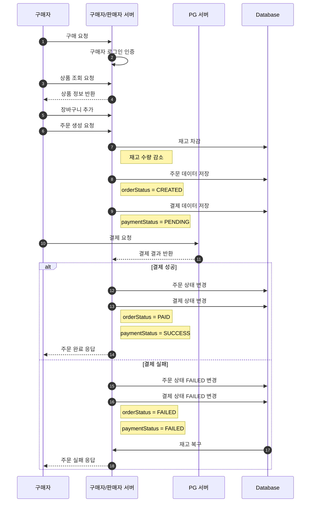
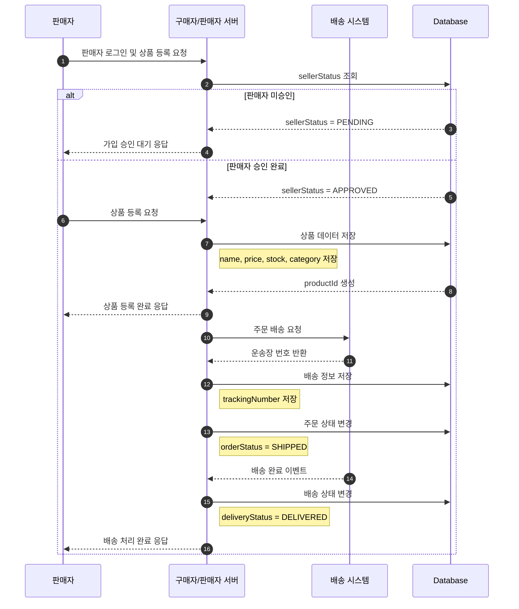
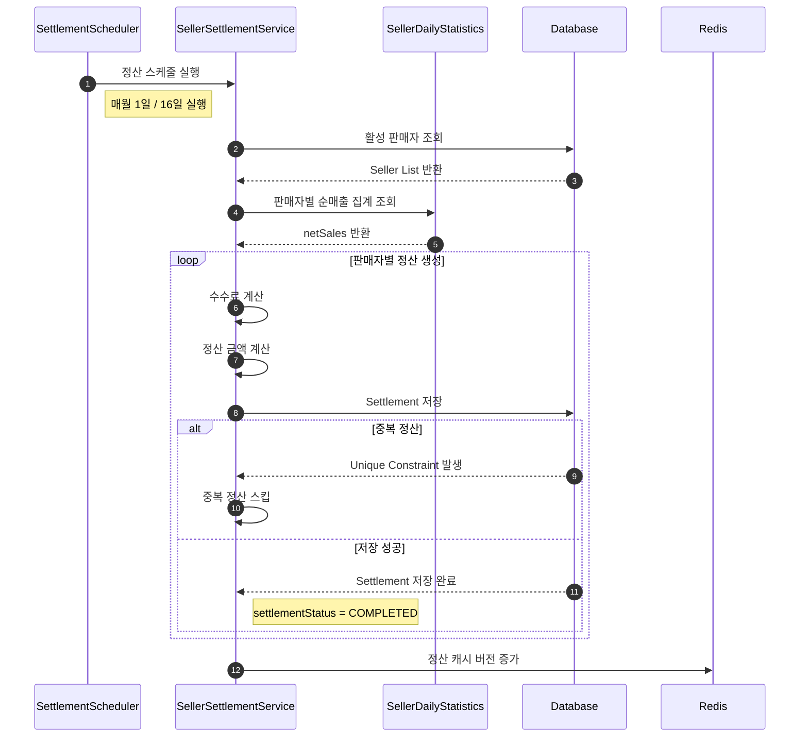
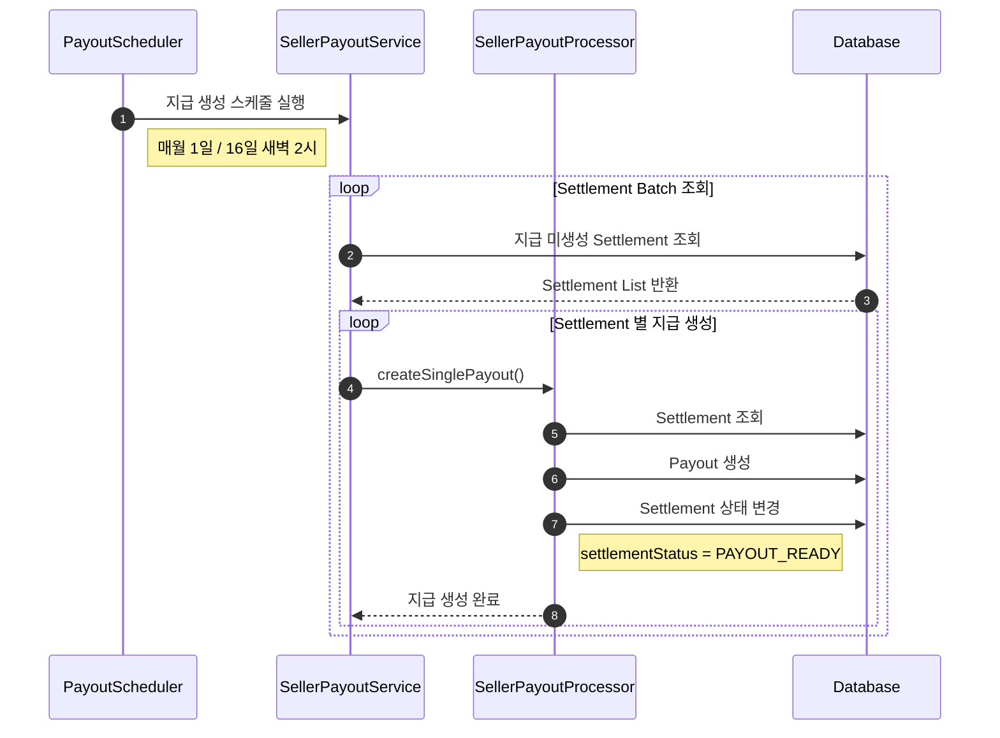
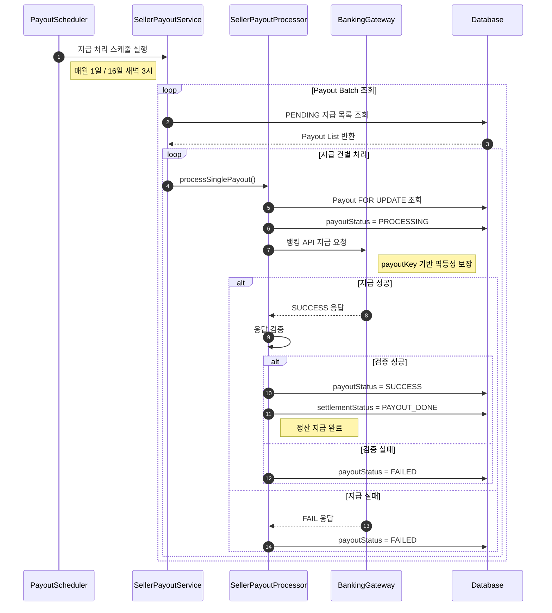
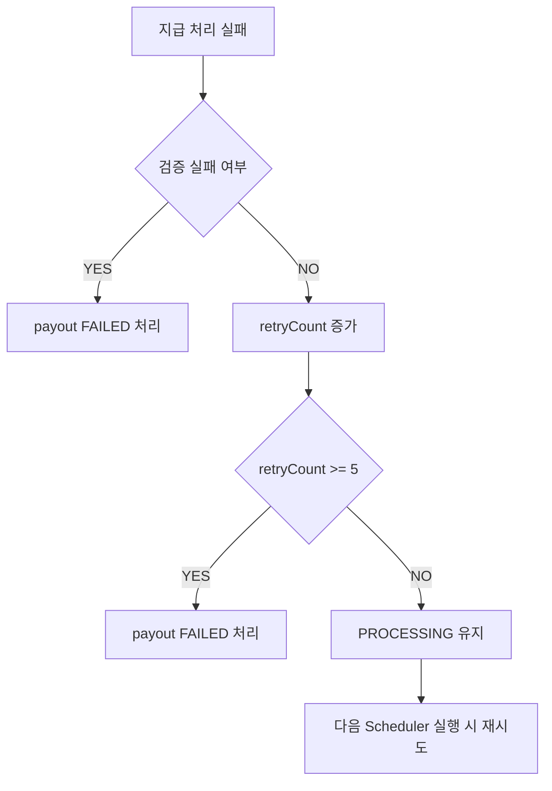
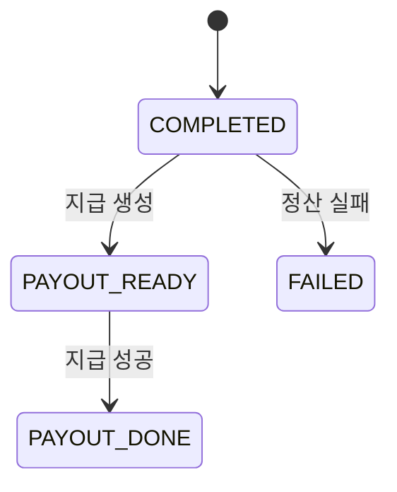
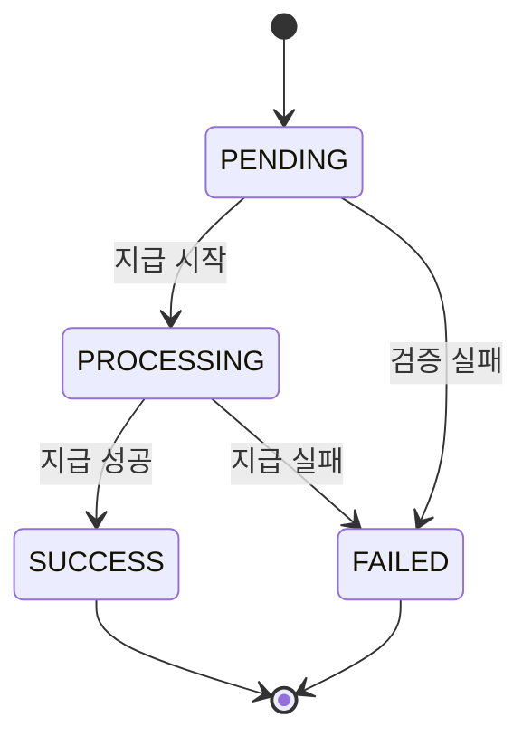

# 🖥️ 구매자 / 판매자 서버

<br>

---

# 1. 📌 서버 개요

## 서버 소개

구매자 / 판매자 및 상품, 결제, 주문 등 전반적인 서비스 기능을 담당 하는 서버

<br>

---

# 2. 📡 주요 API

| Method | URI                                | Description     | Role  |
|--------|------------------------------------|-----------------|-------|
| GET    | /products                          | 전체 상품 조회 API    | BUYER |
| POST   | /carts/items                       | 장바구니 상품 추가 API  | BUYER |
| POST   | /orders                            | 주문 생성 API       | BUYER |
| POST   | /payments                          | 결제 생성 API       | BUYER |
| POST   | /orders/{orderId}/refunds          | 환불 신청 API       | BUYER |
| POST   | /restock-subscriptions             | 재입고 알림 신청 API   | BUYER |
| DELETE | /restock-subscriptions/{productId} | 재입고 알림 취소 API   | BUYER |
| PUT    | /restock-notifications/me          | 알림 전체 읽음 처리 API | BUYER |

<br>

| Method | URI                             | Description        | Role   |
|--------|---------------------------------|--------------------|--------|
| POST   | /seller/products                | 상품 등록 API          | SELLER |
| GET    | /seller/dashboard               | 대시보드 조회 API        | SELLER |
| POST   | /seller/dashboard/refresh       | 대시보드 캐시 삭제 API     | SELLER |
| GET    | /seller/statistics/daily/{date} | 특정 날짜 통계 자료 조회 API | SELLER |
| GET    | /seller/statistics/summary      | 특정 기간 통계 자료 조회 API | SELLER |
| GET    | /seller/settlements             | 정산 전체 조회 API       | SELLER |

<br>

---

# 3. 🔄 서비스 플로우

## 구매 플로우



<br>

## 판매 플로우


<br>

# 판매자 정산 생성 플로우



<br>

---

# 판매자 지급 생성 플로우



<br>

---

# 판매자 지급 처리 플로우



<br>

---

# 지급 재시도 전략



<br>

---

# Settlement 상태 흐름



<br>

---

# Payout 상태 흐름




<br>

---

# 4. 🗂️ ERD

```md

```

<br>

---

# 5. 🧠 기술적 의사 결정

## 애플리케이션 레벨 Login Rate Limit 적용을 통한 보안 강화

### 배경

현재 시스템은 로그인 실패 시 "비밀번호 불일치", "존재하지 않는 계정" 등 실패 사유를 구체적으로 응답하고 있습니다. 
이는 일반 사용자에게는 친절한 가이드가 될 수 있으나, 악의적인 공격자에게는 계정 정보를 유추할 수 있는 단서(Enumeration Attack)를 제공하게 됩니다. 
또한, 짧은 시간 내에 수만 번의 로그인을 시도하는 무차별 대입 공격(Brute-Force Attack)에 노출될 경우 
서버 자원(DB 연결, CPU 등)에 과도한 부하가 발생할 위험이 있어 이를 방어할 수단이 필요했습니다.

### 기술 선택지

무차별 대입 공격을 방어하기 위해 인프라 레벨과 애플리케이션 레벨의 두 가지 대안을 검토했습니다.

| 비교 항목 | 옵션 1: Redis 카운터 기반 제한 (선택) | 옵션 2: AWS WAF Rate-Based Rule | 
|-------|-----------------------------------|---------------------------------|
| 차단 위치 |Spring Boot 내부 (서버 도달 후 처리)|AWS WAF (서버 도달 전 차단)|
| 제어 단위 |"IP, 계정, IP+계정 등 세밀한 복합 제어 가능"|IP 단위 위주의 제한|
| 비용    |기존 Redis 인프라 활용 (추가 비용 없음)|ACL 기본료($5) + Rule 비용 + 요청당 비용 발생|
| 유연성   |윈도우(TTL) 및 임계값을 로직에 따라 자유롭게 설정|최소 5분 고정 윈도우 등의 제약 존재|
| 테스트   |단위/통합 테스트 코드를 통한 검증 가능|인프라 설정으로 코드 레벨 테스트 불가|

### 선택 이유

Redis 카운터 기반의 애플리케이션 레벨 제한 방식을 최종 선택했습니다.

- 정밀한 제어: 특정 IP뿐만 아니라 특정 계정에 대한 집중 공격까지 감지하여 계정 잠금(Account Lockout) 등으로 확장하기 용이합니다.

- 비용 및 효율: 추가 인프라 구축 없이 기존 Redis를 활용하며, 무차별 대입 공격 시 실제 인증(DB 조회) 단계 이전에 차단하여 서버 자원을 보호합니다.

- 비즈니스 통합: 차단 시 보안 로깅을 남기거나 관리자에게 알림을 보내는 등 서비스 요구사항에 맞춘 유연한 대응이 가능합니다.

### 해결 및 결과

1. 실패 메시지 단일화: 클라이언트 응답을 "로그인 실패: 사용자의 정보가 올바르지 않습니다"로 통일하여 정보 유출을 방지하고, 상세 사유는 내부 로그에만 기록했습니다.

2. LoginRateLimitFilter 구현: Spring Security 필터 체인 앞단에 배치하여 효율적인 차단 구조를 구축했습니다.

   - 임계값: 동일 IP 기준 10회 실패 시 5분(300초)간 차단.

   - IP 스푸핑 방지: ALB 환경을 고려하여 X-Forwarded-For 헤더의 마지막 값을 검증하여 실제 클라이언트 IP를 식별했습니다.

3. 결과: 공격자가 임계값을 초과하여 로그인 시도 시 429 Too Many Requests를 반환함으로써, 실제 인증 로직 수행을 막고 시스템 전체의 안정성과 보안성을 확보했습니다.

<br>

---

## Refresh Token Rotation 및 Blacklist 도입을 통한 인증 보안 강화

### 배경

기존의 단순 JWT 인증 방식은 Access Token의 탈취 위험을 줄이기 위해 만료 시간을 짧게 설정하지만, 이로 인해 사용자가 자주 재로그인해야 하는 불편함(UX 저하)이 발생합니다. 
이를 보완하기 위해 Refresh Token을 사용하지만, 이 역시 탈취될 경우 유효 기간 동안 공격자가 지속적으로 새로운 Access Token을 발급받을 수 있는 '무한 재발급'의 위험을 내포하고 있습니다. 
특히 토큰 자체에 정보를 담지 않는 Opaque Token(UUID) 방식을 채택하고 있어, 서버 측에서 토큰의 오용 여부를 정밀하게 제어할 메커니즘이 절실했습니다.

### 기술 선택지

토큰 보안을 강화하기 위해 고려한 전략은 다음과 같습니다

| 비교 항목 | 옵션 1: 단순 Refresh Token    | 옵션 2: Refresh Token Rotation (선택) |
|-------|---------------------------|---------------------------|
| 재사용 정책 | 만료 전까지 동일 토큰 반복 사용        | 1회 사용 시 즉시 폐기 및 새 토큰 교체   |
| 탈취 대응 | 탈취 시 만료 전까지 공격자 이용 차단 불가  | 이미 사용된 토큰 유입 시 즉시 침해 탐지 가능|
| 로그아웃 제어 | 클라이언트 측 토큰 삭제에만 의존        | 서버 Redis에서 즉시 삭제 및 Blacklist 관리 |
| 보안 수준 | 보통 (토큰 유출 시 취약)           | 매우 높음 (재사용 및 탈취 공격 원천 차단) |

### 선택 이유

보안성과 사용자 편의성의 균형을 맞추기 위해 Refresh Token Rotation(RTR) 전략을 선택했습니다.

- 침해 탐지 능력: RTR은 토큰 사용 즉시 삭제되므로, 동일 토큰이 다시 유입된다는 것 자체가 탈취된 토큰의 재사용 시도로 간주되어 즉각적인 방어가 가능합니다.

- 원자적 무효화: Redis의 getAndDelete() 연산을 활용하여 조회와 삭제를 하나의 원자적(Atomic) 트랜잭션으로 처리함으로써 동시성 이슈를 해결했습니다.

- 중앙 집중식 세션 제어: user_refreshes:{userId} Set 구조를 통해 멀티 디바이스 로그아웃 및 특정 사용자의 전체 세션 강제 종료 기능을 확보했습니다.

### 해결 및 결과

1. RTR 아키텍처 구축:

    Redis를 저장소로 활용하여 UUID 기반의 불투명 토큰(Opaque Token) 관리.

    토큰 재발급 요청 시 기존 토큰을 즉시 폐기하고 새로운 UUID 토큰을 발급하여 교체.

2. 보안 전송 체계 수립:

    Refresh Token을 응답 바디가 아닌 HttpOnly, Secure, SameSite=Strict 옵션이 적용된 쿠키로만 전달하여 XSS 및 CSRF 공격을 이중으로 방어했습니다.

3. Blacklist 시스템 도입:

    로그아웃 시 사용 중인 Access Token을 Redis 블랙리스트에 등록하여, 토큰 유효 기간이 남아있더라도 즉시 무효화되도록 구현했습니다.

4. 결과:

    탈취 토큰 재사용 원천 차단: 한 번 사용된 토큰은 폐기되므로 공격자의 재사용이 불가능해졌습니다.

    세션 관리 기능 강화: 멀티 디바이스 로그인 추적 및 로그아웃 시 모든 기기의 연결을 일괄 종료할 수 있는 기능을 확보했습니다.

<br>

---

## 제목

### 배경

내용 작성

### 기술 선택지

내용 작성

### 선택 이유

내용 작성

### 해결 및 결과

내용 작성

<br>

---

## 제목

### 배경

내용 작성

### 기술 선택지

내용 작성

### 선택 이유

내용 작성

### 해결 및 결과

내용 작성

<br>

---

## 제목

### 배경

내용 작성

### 기술 선택지

내용 작성

### 선택 이유

내용 작성

### 해결 및 결과

내용 작성

<br>

---

## 제목

### 배경

내용 작성

### 기술 선택지

내용 작성

### 선택 이유

내용 작성

### 해결 및 결과

내용 작성

<br>

---

## 제목

### 배경

내용 작성

### 기술 선택지

내용 작성

### 선택 이유

내용 작성

### 해결 및 결과

내용 작성

<br>

---

## 제목

### 배경

내용 작성

### 기술 선택지

내용 작성

### 선택 이유

내용 작성

### 해결 및 결과

내용 작성

<br>

---

## 제목

### 배경

내용 작성

### 기술 선택지

내용 작성

### 선택 이유

내용 작성

### 해결 및 결과

내용 작성

<br>

---

## 제목

### 배경

내용 작성

### 기술 선택지

내용 작성

### 선택 이유

내용 작성

### 해결 및 결과

내용 작성

<br>

---

## 제목

### 배경

내용 작성

### 기술 선택지

내용 작성

### 선택 이유

내용 작성

### 해결 및 결과

내용 작성

<br>

---

## 제목

### 배경

내용 작성

### 기술 선택지

내용 작성

### 선택 이유

내용 작성

### 해결 및 결과

내용 작성

<br>

---

## 제목

### 배경

내용 작성

### 기술 선택지

내용 작성

### 선택 이유

내용 작성

### 해결 및 결과

내용 작성

<br>

---

## 제목

### 배경

내용 작성

### 기술 선택지

내용 작성

### 선택 이유

내용 작성

### 해결 및 결과

내용 작성

<br>

---

## 제목

### 배경

내용 작성

### 기술 선택지

내용 작성

### 선택 이유

내용 작성

### 해결 및 결과

내용 작성

<br>

---

## 제목

### 배경

내용 작성

### 기술 선택지

내용 작성

### 선택 이유

내용 작성

### 해결 및 결과

내용 작성

<br>

---

## 제목

### 배경

내용 작성

### 기술 선택지

내용 작성

### 선택 이유

내용 작성

### 해결 및 결과

내용 작성

<br>

---

## 제목

### 배경

내용 작성

### 기술 선택지

내용 작성

### 선택 이유

내용 작성

### 해결 및 결과

내용 작성

<br>

---

## 제목

### 배경

내용 작성

### 기술 선택지

내용 작성

### 선택 이유

내용 작성

### 해결 및 결과

내용 작성

<br>

---

## 제목

### 배경

내용 작성

### 기술 선택지

내용 작성

### 선택 이유

내용 작성

### 해결 및 결과

내용 작성

<br>

---

## 제목

### 배경

내용 작성

### 기술 선택지

내용 작성

### 선택 이유

내용 작성

### 해결 및 결과

내용 작성

<br>

---

## 제목

### 배경

내용 작성

### 기술 선택지

내용 작성

### 선택 이유

내용 작성

### 해결 및 결과

내용 작성

<br>

---

# 6. 🚨 트러블 슈팅

## 메시지 유실 문제

### 문제

문제 내용 작성

### 원인

원인 내용 작성

### 해결

해결 내용 작성

### 결과

결과 내용 작성

<br>

---

## 성능 저하 문제

### 문제

문제 내용 작성

### 원인

원인 내용 작성

### 해결

해결 내용 작성

### 결과

결과 내용 작성

<br>