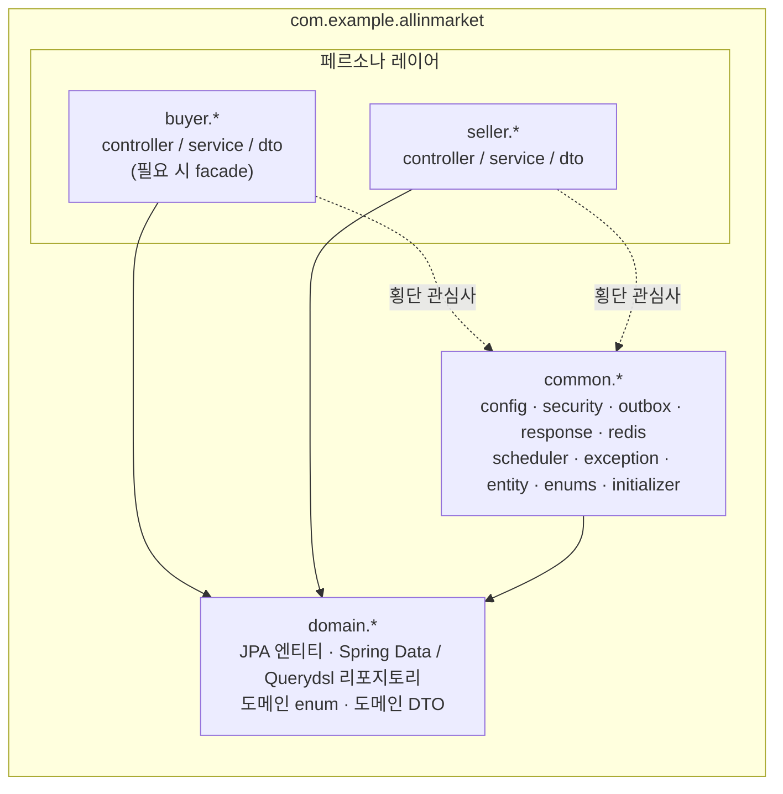
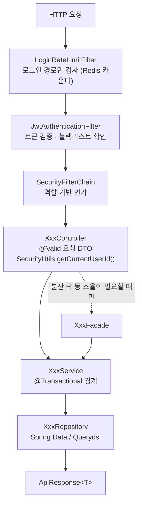
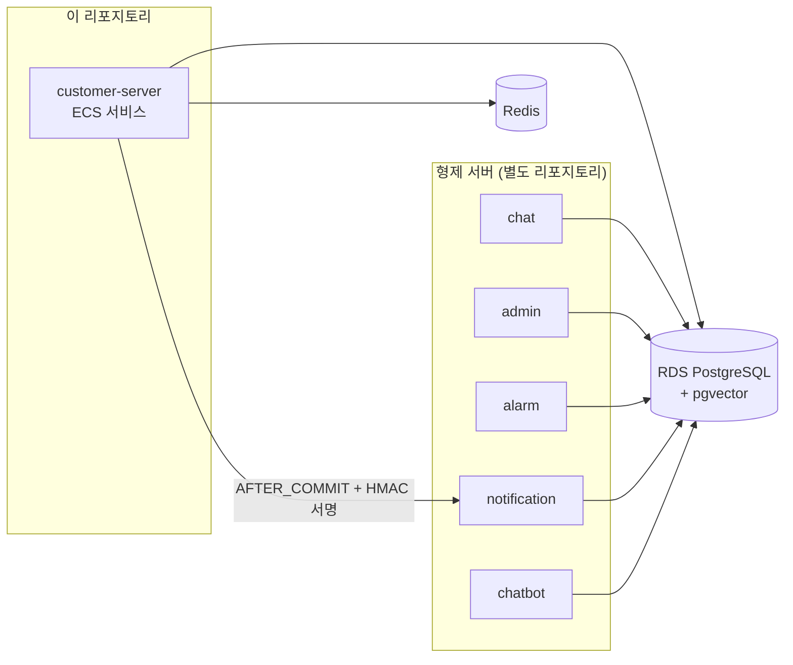

# 아키텍처 구조 (코드 네비게이션 가이드)

> **이 문서의 역할**: "어떤 코드가 어디에 있고, 새 코드를 어디에 놓아야 하는가".
> 설계 **근거와 요구사항**은 [TRD.md](./TRD.md) / [PRD.md](./PRD.md)를 본다.
>
> 관련: [API_REFERENCE.md](./API_REFERENCE.md) · [AUTH.md](./AUTH.md) · [PERSISTENCE.md](./PERSISTENCE.md) · [rules/CODE_CONVENTION.md](./rules/CODE_CONVENTION.md)

---

## 1. 최상위 패키지 경계

루트 패키지: `com.example.allinmarket`

| 패키지 | 담는 것 | 담지 않는 것 |
|---|---|---|
| `domain.*` | JPA 엔티티, Spring Data/Querydsl 리포지토리, 도메인 enum, 도메인 DTO | **비즈니스 로직** (예외: 아래 §1.1) |
| `buyer.*` | 구매자 API의 `controller` / `service` / `dto` (필요 시 `facade`) | 엔티티, 리포지토리 |
| `seller.*` | 판매자 API의 `controller` / `service` / `dto` | 엔티티, 리포지토리 |
| `common.*` | 횡단 관심사: `config`, `security`, `outbox`, `response`, `redis`, `scheduler`, `exception`, `entity`, `enums`, `initializer` | 특정 페르소나 전용 로직 |

화살표는 **허용된 의존 방향**이다. 역방향(`domain` → `buyer`/`seller`)은 만들지 않는다.

**핵심 규칙**: 새 기능은 `domain`에 엔티티/리포지토리를, `buyer` 또는 `seller`에 서비스/컨트롤러를 만든다. `domain`에 서비스 로직을 넣지 않는다.

### 1.1 예외 사례 (기존 코드)

- `domain/transactionhistory/service/TransactionHistoryService.java` — 두 페르소나 공용 이력 기록이라 `domain`에 남아 있다.
- `seller/entity/Seller.java`, `buyer/entity/Buyer.java`, `*/repository/` — 회원 엔티티만 페르소나 패키지에 있다. 나머지 엔티티는 모두 `domain`에 있다.

새 코드를 이 예외에 맞춰 확장하지 말고, 위 표의 기본 규칙을 따른다.

---

## 2. 기능별 패키지 맵

### 2.1 구매자 (`buyer.*`)

| 기능 | 패키지 | 핵심 클래스 |
|---|---|---|
| 인증 | `buyer/auth` | `BuyerAuthController`, `BuyerAuthService` |
| 프로필 | `buyer/me` | `BuyerMeController` |
| 배송지 | `buyer/address` | `BuyerAddressController` |
| 상품 조회 | `buyer/product` | `BuyerProductController`, `BuyerProductService` (Redis 캐시) |
| 카테고리 | `buyer/category` | `BuyerCategoryController` |
| 장바구니 | `buyer/cart`, `buyer/cartitem` | `BuyerCartController`, `BuyerCartService` |
| 주문 | `buyer/order` | `BuyerPaymentOrderFacade`(분산 락), `BuyerOrderService`, `OrderValidator`, `StockReleaseService` |
| 결제 | `buyer/payment` | `BuyerPaymentService`, `PaymentStateService`, `PaymentRetryService`, `client/PaymentGateway`·`MockPaymentGateway` |
| 환불 | `buyer/refund` | `BuyerRefundService` |
| 재입고 구독 | `buyer/restocksubscription` | `BuyerRestockSubscriptionService` |
| 재입고 알림 | `buyer/restocknotification` | `RestockNotificationService` |
| 상수 | `buyer/consts` | `BuyerConsts.PRODUCT_LOCK_PREFIX` |

### 2.2 판매자 (`seller.*`)

| 기능 | 패키지 | 핵심 클래스 |
|---|---|---|
| 인증 | `seller/auth` | `SellerAuthService` (승인 상태 검사 지점) |
| 프로필 | `seller/me` | `SellerMeController` |
| 상품 | `seller/product` | `SellerProductController`(이미지 업로드 포함), `SellerProductService` |
| 주문 상품 | `seller/orderitem` | `SellerOrderItemService` |
| 대시보드 | `seller/dashboard` | `SellerDashboardService`(캐시), `DashboardService`, `SellerDashboardProcessor`, `DashboardRowCreatorService` |
| 일별 통계 | `seller/dailystatistics` | `SellerDailyStatisticsService` |
| 정산 | `seller/settlement` | `SellerSettlementService` |
| 지급 | `seller/payout` | `SellerPayoutService`, `SellerPayoutProcessor`, `SellerPayoutFailHandler` |
| 상수 | `seller/consts` | `SellerConsts.COMMISSION_RATE` |

> **대시보드 서비스가 4개인 이유**: 트랜잭션 전파 속성이 다른 로직을 자가 호출(self-invocation)하면 프록시를 거치지 않아 `REQUIRES_NEW`가 무시된다. 이를 피하려고 클래스를 분리했다(README 트러블슈팅 참고). 여기에 메서드를 추가할 때 **같은 클래스 안에서 다른 전파 속성 메서드를 호출하지 않도록** 주의한다.

### 2.3 공통 (`common.*`)

| 패키지 | 클래스 | 역할 |
|---|---|---|
| `common/config` | `SecurityConfig` | 필터 체인·인가 규칙 → [AUTH.md](./AUTH.md) |
| | `GlobalExceptionHandler` | 예외 → `ApiResponse` 변환 |
| | `QuerydslConfig`, `JpaAuditingConfig` | JPAQueryFactory 빈, `@CreatedDate`/`@LastModifiedDate` |
| | `AsyncConfig`, `EnableRetryConfig` | `@Async`, `@Retryable` 활성화 |
| | `JacksonConfig`, `RestClientConfig`, `S3Config`, `PasswordEncoderConfig` | 직렬화, 외부 호출, 파일, 암호화 |
| `common/response` | `ApiResponse`, `PageResponse` | 응답 봉투 → [API_REFERENCE.md](./API_REFERENCE.md) |
| `common/enums` | `SuccessEnum`, `ErrorEnum`, `UserRole` | 응답 메타데이터 |
| `common/exception` | `BaseException` | 모든 도메인 예외의 부모 |
| `common/entity` | `CreatableEntity`, `ModifiableEntity`, `DeletableEntity` | 감사 필드 상속용 베이스. 새 엔티티는 이 중 하나를 상속 |
| `common/security` | `JwtProvider`, `JwtAuthenticationFilter`, `LoginRateLimitFilter`, `SecurityUtils`, `HmacSigner` | → [AUTH.md](./AUTH.md) |
| `common/redis` | `RedisConfig`, `RedisLock`, `RedisLockAspect` | Redisson 설정 및 애노테이션 기반 락 |
| `common/outbox` | `DashboardOutbox`, `HistoryOutbox` + repository/service/payload | 트랜잭셔널 아웃박스 → [PERSISTENCE.md](./PERSISTENCE.md) |
| `common/scheduler` | 7개 스케줄러 | §4 |
| `common/initializer` | `BuyerInitializer`, `SellerInitializer`, `dummy/*` | 시드 데이터, datafaker 기반 더미 생성 |

---

## 3. 요청 처리 흐름

- 컨트롤러는 인증 주체를 파라미터로 받지 않고 `SecurityUtils.getCurrentUserId()`로 꺼낸다.
- 컨트롤러는 `ResponseEntity<ApiResponse<T>>`를 반환한다.

### 3.1 Facade를 쓰는 기준

같은 레이어 간 상호 의존이 **불가피할 때만** 도입한다. 현재 유일한 사례:

- `buyer/order/facade/BuyerPaymentOrderFacade` — 장바구니 조회 + 상품별 Redisson 락 획득 + 주문 서비스 호출을 조율한다. 락 획득/해제가 트랜잭션 밖에 있어야 하므로 서비스가 아니라 파사드에 있다.

새 파사드는 임의로 추가하지 말고 이슈로 논의한다([rules/CODE_CONVENTION.md](./rules/CODE_CONVENTION.md)).

---

## 4. 스케줄러

`common/scheduler` — 모든 배치 진입점이 여기 모여 있다.

스케줄링 활성화는 `common/config/SchedulingConfig`(`@EnableScheduling` + 전용 `ThreadPoolTaskScheduler`, `poolSize=5`)가 담당하며, `app.scheduling.enabled` 프로퍼티(기본 `true`, `application-local.yml`은 `false`)로 켜고 끌 수 있다. 전용 스케줄러가 없으면 Spring 기본 풀 크기가 1이라 스케줄러 7개가 단일 스레드에 직렬화되므로, 풀 크기를 반드시 명시한다.

| 클래스 | 주기 | 역할 |
|---|---|---|
| `OrderExpiryScheduler` | `fixedDelay = 60_000` | 30분 미결제 주문 만료 + 재고 복구. `app.scheduling.order-expiry.{chunk-size,max-loops}`로 청크 크기/반복 상한 제어. 한 청크에서 진행(성공)이 전혀 없으면 루프를 즉시 중단한다 |
| `DashboardOutboxScheduler` | `fixedDelay = 60000` | 대시보드 아웃박스 처리. `app.scheduling.outbox.{chunk-size,max-retry}`로 제어, 기본 재시도 상한은 `DashboardOutBoxConsts.MAX_RETRY_COUNT`(5) |
| `HistoryOutboxScheduler` | `fixedDelay = 300_000` | 거래 이력 아웃박스 처리 |
| `DailyStatisticsScheduler` | `0 0 0 * * *` | 일별 판매 통계 생성 |
| `DashboardScheduler` | `0 0 0 * * *` | 일자 전환 대시보드 리셋 |
| `SettlementScheduler` | `0 20 0 16 * *` / `0 20 0 1 * *` | MID / END 정산 생성 |
| `PayoutScheduler` | `0 0 2 1,16 * *` / `0 0 3 1,16 * *` | 지급 생성 / 지급 처리 |

**주의**: ECS 멀티 인스턴스 환경이므로 모든 스케줄러가 **모든 인스턴스에서 동시에** 실행된다. 새 배치를 추가할 때는 비관적 락(아웃박스 방식) 또는 유니크 제약으로 중복 처리를 막아야 한다.

---

## 5. 외부 연동

| 대상 | 진입점 | 방식 |
|---|---|---|
| 알림 서버 | `domain/restocksubscription/event/RestockEventListener` | `@TransactionalEventListener(AFTER_COMMIT)` + `@Retryable(maxAttempts=4)`, `HmacSigner` 서명, `notification-server.url` |
| 결제 PG | `buyer/payment/client/PaymentGateway` (구현: `MockPaymentGateway`) | 현재 Mock. 실 PG 연동 시 이 인터페이스를 구현 |
| S3 / CloudFront | `common/config/S3Config`, `seller/product` 이미지 업로드 | `PRODUCT_IMAGE_BUCKET`, `cdn.url` |
| 뱅킹 | `seller/payout` + `domain/banking` | `payout_key` 기반 멱등 요청 |

**이벤트 발행 규칙**: 외부 호출은 반드시 트랜잭션 커밋 이후(`AFTER_COMMIT`)에 하거나 아웃박스에 적재한다. 트랜잭션 안에서 직접 호출하면 롤백된 변경으로 외부 시스템이 오염된다.

---

## 6. 배포 단위

이 리포지토리는 **customer-server 한 개**의 ECS 서비스로 배포된다. 같은 RDS/Redis를 공유하는 형제 서버(chat, admin, alarm, notification, chatbot)는 별도 리포지토리다.

- 채팅 테이블(`realtime_chat_*`), 벡터 스토어(`langchain4j_embedding_store`) 마이그레이션은 이 리포지토리가 관리하지만 **애플리케이션 코드는 없다.** 해당 테이블 스키마를 바꿀 때는 형제 서버 영향도를 먼저 확인한다.
- 인프라 코드: `infra/*.tf` (Terraform), CI/CD: `.github/workflows/{ci,cd}.yml`
