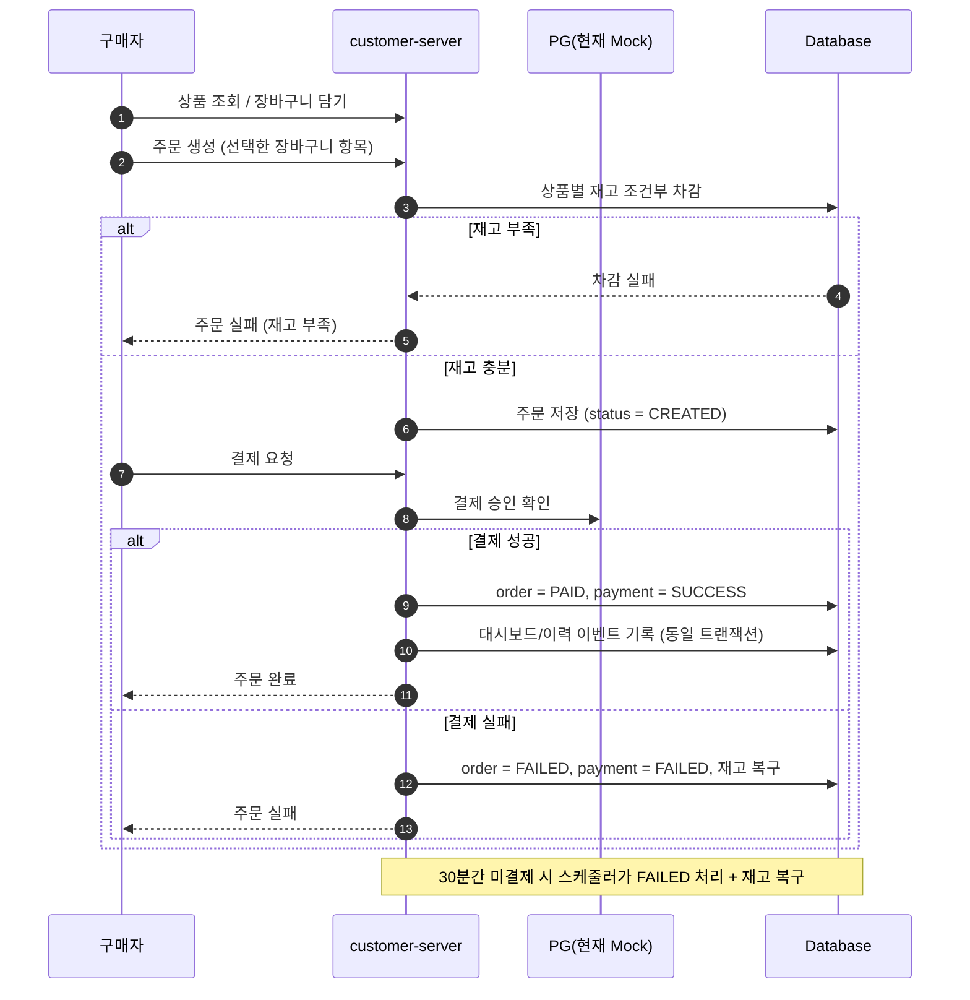
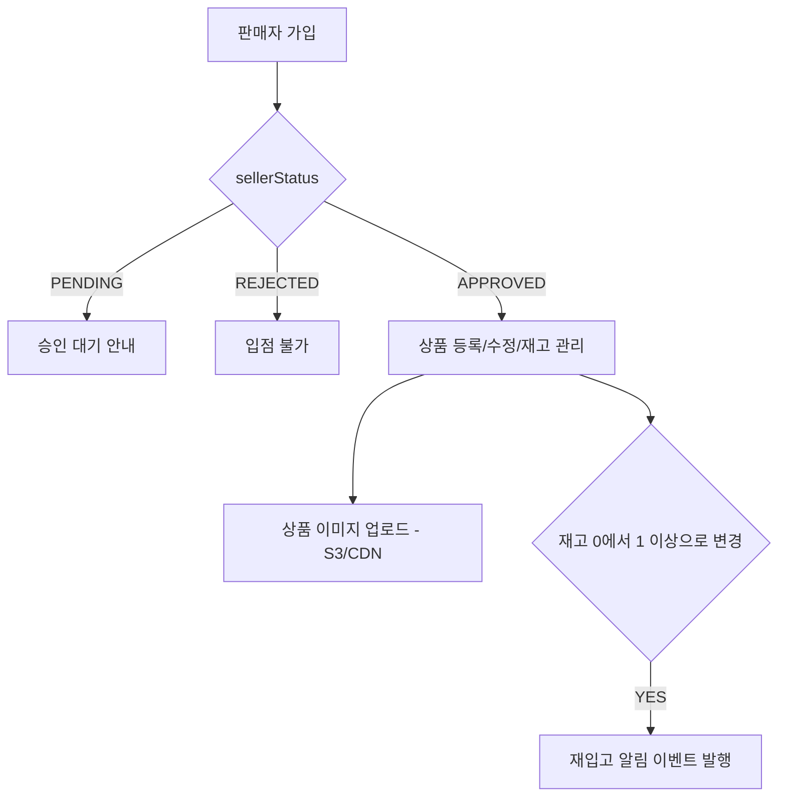
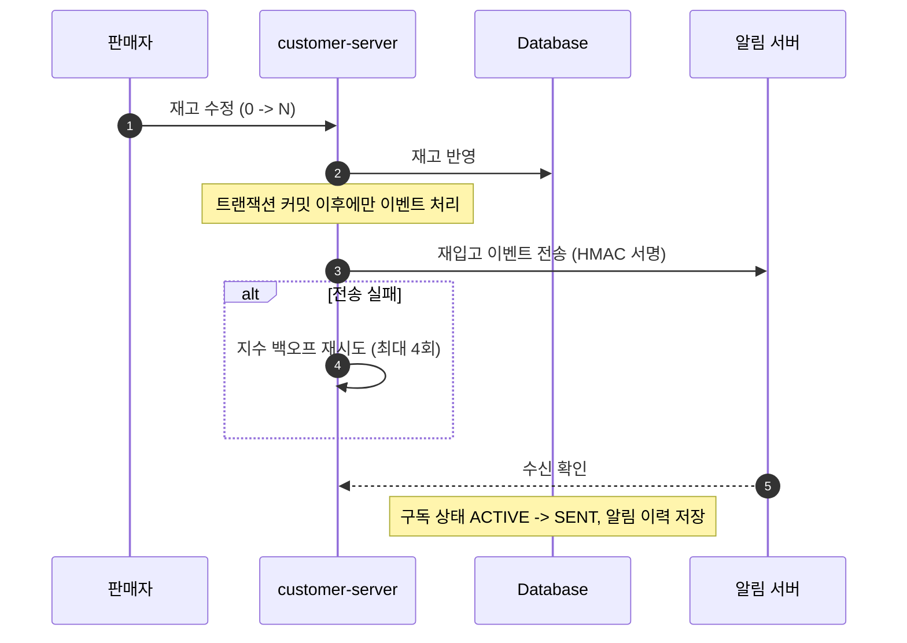
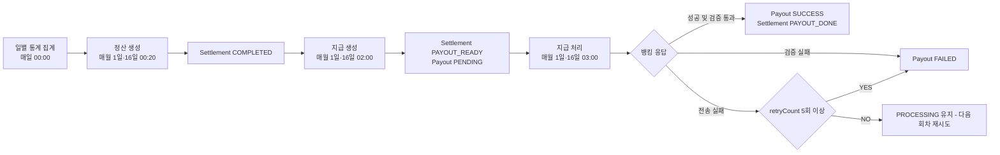
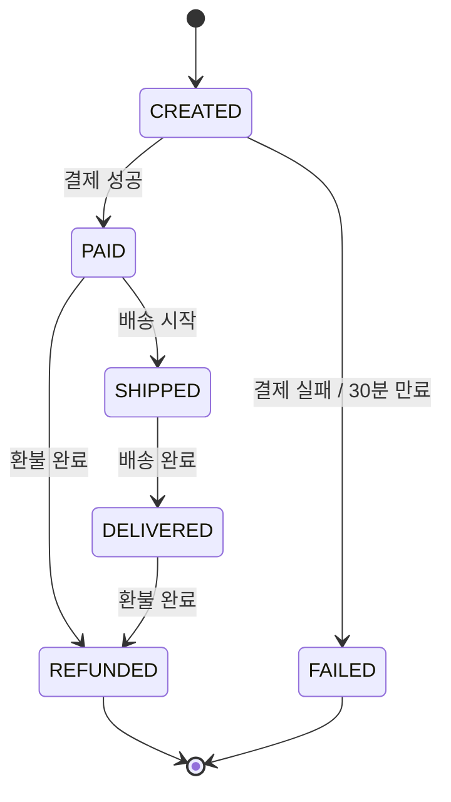

# all-in-market PRD (Product Requirements Document)

> **문서 버전** v1.0 · **작성일** 2026-08-25 · **대상 시스템** all-in-market 멀티 벤더 이커머스 플랫폼
>
> 관련 문서: [README.md](../README.md) · [TRD.md](./TRD.md) · [CODE_CONVENTION.md](./rules/CODE_CONVENTION.md) · [technical-decisions.md](./technical-decisions.md) · [troubleshooting.md](./troubleshooting.md)

---

## 1. 문서 개요

### 1.1 목적

이 문서는 all-in-market이 **누구를 위해, 어떤 문제를, 어떤 규칙으로 해결하는가**를 정의한다.
"어떻게 구현했는가"는 [TRD.md](./TRD.md)에서 다룬다.

### 1.2 범위

| 구분 | 내용 | 담당 서버 |
|---|---|---|
| 포함 | 회원(구매자/판매자) 가입·인증, 상품/카테고리, 장바구니, 주문, 결제, 환불, 재입고 구독·알림, 판매자 대시보드/통계, 정산·지급 | `customer-server` (이 리포지토리) |
| 포함 (제품 관점) | 1:1 실시간 채팅, 재입고/주문상태 알림 발송, AI 챗봇 상담 | 별도 서버(chat / notification / chatbot). 스키마와 인증 규약은 이 리포지토리와 공유 |
| 제외 | 배송사 연동, 관리자 백오피스 화면, 실 PG사 연동 | 미구현 또는 외부 시스템 (§9 참고) |

### 1.3 용어 정의

| 용어 | 정의 |
|---|---|
| 구매자(Buyer) | 상품을 검색·구매하는 사용자. `ROLE_BUYER` |
| 판매자(Seller) | 플랫폼에 입점해 상품을 판매하는 사업자. `ROLE_SELLER`, 사업자등록번호(`biz_number`)와 정산 계좌 보유 |
| 입점 승인 | 판매자 가입 후 `PENDING` → `APPROVED` 로 전환되는 절차. 승인 전에는 판매 기능 사용 불가 |
| 주문(Order) | 하나의 구매 요청. 여러 판매자의 상품(OrderItem)을 포함할 수 있다 |
| 주문 상품(OrderItem) | 주문 내 개별 상품 라인. `seller_id`를 보관해 **판매자별 주문 분리**의 기준이 된다 |
| 일별 통계(Daily Statistics) | 판매자별 일 단위 매출/주문/환불 집계. 정산의 원천 데이터 |
| 정산(Settlement) | 일별 통계를 기간 단위로 합산해 수수료를 차감한 **지급 예정 금액**을 확정하는 것 |
| 지급(Payout) | 확정된 정산 금액을 판매자 계좌로 실제 송금하는 것 |
| 재입고 구독(Restock Subscription) | 품절 상품에 대해 재입고 시 알림을 받겠다는 구매자의 신청 |

---

## 2. 제품 개요

### 2.1 한 줄 정의

> **고트래픽 환경에서도 안정적인 주문 처리를 보장하는 멀티 벤더 이커머스 백엔드**

다수의 판매자가 입점해 상품을 판매하고, 구매자는 여러 판매자의 상품을 한 번에 담아 구매하는 쿠팡형 플랫폼이다.

### 2.2 해결하려는 문제

| # | 문제 | 왜 어려운가 | 제품이 제공하는 해답 |
|---|---|---|---|
| P1 | **재고 동시성** | 한정 수량 상품에 요청이 몰리면 초과 판매(oversell)가 발생한다 | 상품 단위 분산 락 + DB 조건부 원자 차감의 이중 방어 (§8.1) |
| P2 | **주문 상태 전이의 일관성** | 결제 실패·중복 결제·미결제 방치가 재고와 금액을 어긋나게 만든다 | 상태 전이 규칙 고정(§7.1), 결제 성공 유니크 제약, 30분 미결제 자동 만료 및 재고 복구 |
| P3 | **판매자별 주문 분리** | 하나의 주문에 여러 판매자 상품이 섞여 있어 판매자는 자기 몫만 봐야 한다 | `OrderItem.seller_id` 기준 조회/집계/정산 분리 |
| P4 | **실시간 알림·상담** | 품절/문의는 이탈로 이어진다 | 재입고 구독 알림, 1:1 실시간 채팅, 24시간 AI 챗봇 |
| P5 | **정산 신뢰성** | 수기 정산은 누락·중복·재시도 추적이 어렵다 | 통계 기반 자동 정산(월 2회) → 멱등한 지급 파이프라인 |

### 2.3 성공 기준 (제품 레벨)

- 동시 주문 상황에서 **초과 판매 0건**, 동일 주문 **중복 결제 성공 0건**.
- 대시보드/알림 서버 장애가 **결제 성공률에 영향을 주지 않을 것**.
- 판매자가 로그인 후 **자신의 매출·정산 현황을 별도 요청 없이** 확인 가능할 것.

---

## 3. 사용자 및 페르소나

| 페르소나 | 목표 | 현재의 pain point | 핵심 제공 기능 |
|---|---|---|---|
| **구매자** | 원하는 상품을 빠르게 찾아 한 번에 결제 | 여러 판매자 상품을 따로 결제해야 함 / 품절 상품을 다시 확인하러 들어와야 함 | 통합 장바구니·주문·결제, 배송지 관리, 재입고 알림, 1:1 채팅, AI 챗봇 |
| **판매자** | 상품·재고·주문을 직접 운영하고 정산을 예측 | 매출 집계를 수기로 하고 정산 근거가 불투명함 | 상품/재고 관리, 판매자별 주문 조회, 대시보드·기간 통계, 정산 내역 조회 |
| **관리자** | 판매자 입점 심사, 운영 지표 확인 | — | 판매자 상태(`PENDING`/`APPROVED`/`REJECTED`) 관리 — *관리자 API는 이 리포지토리 범위 밖(별도 admin 서버)이며, 여기에는 `admins` 테이블과 시드 설정(`app.init.admin.enabled`)만 존재한다* |

---

## 4. 핵심 기능

각 기능의 구현 위치와 상세 설계는 [TRD.md](./TRD.md)에서 이어진다.

### F1. 누구나 입점하고 판매할 수 있는 멀티 벤더 운영

**설명** 판매자는 가입 후 승인 절차를 거쳐 상품을 등록하고, 재고와 주문을 직접 관리한다. 여러 판매자가 같은 플랫폼에서 동시에 상품을 운영한다.

**사용자 스토리**
- 판매자로서, 사업자 정보와 정산 계좌를 등록해 입점 신청하고 싶다.
- 판매자로서, 내 상품만 등록·수정·삭제하고 재고를 조정하고 싶다.
- 판매자로서, 내 상품이 포함된 주문 건만 조회하고 싶다.

**수용 기준**
- 판매자 가입 시 상태는 `PENDING`이고, `APPROVED`가 아니면 **로그인 단계에서 차단**되어 판매 기능을 사용할 수 없다.
- 정산 대상은 `APPROVED`이면서 탈퇴하지 않은 판매자로 한정된다.
- 사업자등록번호와 이메일은 각각 전역 유니크다.
- 상품 등록 시 이름/설명/가격/재고/카테고리가 필수이며, 가격·재고는 0 이상이다.
- 상품 이미지는 다중 업로드 가능하며 대표 이미지 1개와 정렬 순서를 가진다.
- 다른 판매자의 상품에 대한 수정/삭제/재고변경 요청은 거부된다.

**관련 API** `POST /seller/auth/signup`, `POST|GET|PUT|DELETE /seller/products`, `PUT /seller/products/{productId}/stock`, `POST|GET /seller/products/{productId}/images`, `GET /seller/orderitems`, `GET|PUT /sellers/me`

---

### F2. 여러 판매자의 상품을 한 번에 구매

**설명** 서로 다른 판매자의 상품을 하나의 장바구니에 담아 한 번에 주문·결제한다. 상품 조회부터 배송지 관리까지 구매 전 과정을 제공한다.

**사용자 스토리**
- 구매자로서, 로그인 없이도 상품 목록과 상세를 보고 싶다.
- 구매자로서, 여러 판매자의 상품을 장바구니에 담아 한 번에 주문하고 싶다.
- 구매자로서, 자주 쓰는 배송지를 저장하고 기본 배송지로 지정하고 싶다.

**수용 기준**
- 상품 목록/상세 조회와 카테고리 조회는 인증 없이 가능하다.
- 장바구니는 구매자당 1개이며, 주문 시 선택한 장바구니 상품만 주문 대상이 된다.
- 요청한 장바구니 항목 중 하나라도 본인 소유가 아니거나 존재하지 않으면 주문 전체가 실패한다.
- 기본 배송지는 구매자당 최대 1개만 존재한다.
- 주문 생성 시 재고가 부족하면 주문 전체가 실패하고, 어떤 상품의 재고도 차감되지 않는다.
- 결제 성공 시 주문은 `PAID`, 실패 시 `FAILED`로 확정되고 재고가 복구된다.
- 결제되지 않은 주문은 생성 30분 후 자동으로 실패 처리되고 재고가 복구된다.

**관련 API** `GET /products`, `GET /products/{productId}`, `GET /categories`, `POST|GET|PUT|DELETE /carts/items`, `POST|GET /orders`, `POST|GET /payments`, `POST /orders/{orderId}/refunds`, `POST|GET|PUT|DELETE /addresses`

---

### F3. 판매자와의 1:1 실시간 채팅

**설명** 구매자는 상품 문의를 즉시 전달하고, 판매자는 빠르게 응답한다. 읽음 표시로 미확인 메시지를 식별하고, 이전 대화 이력을 조회한다.

> 채팅 API/WebSocket 처리는 **별도 chat 서버**가 담당한다. 이 리포지토리는 채팅 스키마(`realtime_chat_rooms`, `realtime_chat_participants`, `realtime_chat_messages`, `realtime_chat_read_status`)와 회원/인증 기반을 공유한다.

**수용 기준**
- 동일한 (구매자, 판매자) 조합에는 채팅방이 **하나만** 존재한다.
- 구매자와 판매자가 동일 인물인 채팅방은 생성될 수 없다.
- 채팅방 참여자가 아닌 사용자는 메시지를 보내거나 읽음 상태를 기록할 수 없다.
- 메시지는 최신순 커서 기반으로 조회한다. 메시지 최대 길이는 3,000자다.
- 사용자별·방별 읽음 상태는 마지막으로 읽은 메시지 ID로 관리되며 방+사용자당 1건이다.

---

### F4. 품절 상품의 재입고 실시간 알림

**설명** 구매자는 품절 상품에 재입고 알림을 신청하고, 재고가 다시 등록되면 알림을 받는다. 재방문을 유도해 판매 기회를 높인다.

**사용자 스토리**
- 구매자로서, 품절 상품에 재입고 알림을 신청/취소하고 싶다.
- 구매자로서, 내가 받은 알림 목록을 보고 읽음 처리하고 싶다.

**수용 기준**
- 동일 구매자가 같은 상품에 중복 구독할 수 없다((user, product) 유니크).
- 구독 상태는 `ACTIVE`(발송 대기) → `SENT`(발송 완료) → `EXPIRED`(기간 경과 만료)로 관리된다.
- 판매자가 재고를 0에서 1 이상으로 올리면 구독자에게 알림 발송이 트리거된다.
- 알림 발송은 **재고 변경 트랜잭션이 커밋된 이후**에만 시작되며, 발송 실패 시 재시도된다.
- 알림 발송 실패가 판매자의 재고 변경을 롤백시키지 않는다.

**관련 API** `POST /restock-subscriptions`, `GET /restock-subscriptions/me`, `GET /restock-subscriptions/me/{productId}`, `DELETE /restock-subscriptions/{productId}`, `GET|PUT /restock-notifications/me`, `PUT /restock-notifications/{productId}`

---

### F5. 판매 현황 대시보드

**설명** 판매자는 판매량·주문 수·매출을 집계한 대시보드를 확인한다. 일 단위 통계는 자동 집계된다.

**사용자 스토리**
- 판매자로서, 오늘의 주문 수·매출·환불 현황을 즉시 보고 싶다.
- 판매자로서, 특정 날짜와 기간의 통계를 조회하고 싶다.

**수용 기준**
- 대시보드는 판매자별·날짜별로 1건만 존재한다((seller, stat_date) 유니크).
- 대시보드 지표는 주문 수, 총매출, 판매 상품 수, 환불 건수, 환불 금액, 수수료, 정산 예정 금액을 포함한다.
- 결제/환불이 발생하면 대시보드 갱신 이벤트가 **결제 트랜잭션과 함께 기록**되고, 이후 비동기로 반영된다.
- 대시보드 갱신이 지연·실패해도 결제 API는 정상 응답한다.
- 일별 통계는 판매자별·날짜별 1건이며, 매일 자동 생성된다.

**관련 API** `GET /seller/dashboard`, `POST /seller/dashboard/refresh`, `GET /seller/statistics/daily/{date}`, `GET /seller/statistics/summary`

---

### F6. 판매 데이터 기반 자동 정산·지급

**설명** 일별 통계를 근거로 월 2회 정산 금액을 자동 계산하고, 확정된 정산을 판매자 계좌로 지급한다.

**사용자 스토리**
- 판매자로서, 기간별 정산 금액과 차감된 수수료를 확인하고 싶다.
- 운영자로서, 정산이 중복 생성되지 않고 지급이 두 번 나가지 않기를 원한다.

**수용 기준**
- 정산은 (판매자, 기간시작, 기간종료) 조합으로 유니크하며, 중복 생성 시도는 건너뛴다.
- 수수료는 순매출의 **5%**이며, 정산 금액 = 순매출 − 수수료다(소수점 2자리, 버림).
- 정산 상태는 `COMPLETED` → `PAYOUT_READY` → `PAYOUT_DONE`으로 진행하며 실패 시 `FAILED`다.
- 지급은 정산 1건당 1건만 생성되고, 지급 키(`payout_key`)로 멱등성을 보장한다.
- 지급 실패는 최대 5회까지 재시도되며, 응답 검증에 실패하면 즉시 `FAILED` 처리한다.
- 정산 데이터가 갱신되면 판매자의 정산 조회 캐시는 무효화된다.

**관련 API** `GET /seller/settlements` (정산 생성/지급은 스케줄러가 수행)

---

### F7. 365일 24시간 AI 챗봇 상담

**설명** 반품·교환·서비스 정책 관련 문의를 일상 대화처럼 묻고 답변을 받는다.

> 챗봇 응답 생성은 **별도 챗봇 서버**가 담당한다. 이 리포지토리는 정책 문서 임베딩 저장소(`langchain4j_embedding_store`, pgvector 1536차원)와 텍스트 검색 인덱스(`pg_trgm`) 스키마를 관리한다.

**수용 기준**
- 정책 문서는 벡터로 저장되어 의미 기반 검색이 가능하다.
- 텍스트 부분 일치 검색을 위한 트라이그램 인덱스가 유지된다.

---

## 5. 주요 사용자 플로우

### 5.1 구매 플로우

### 5.2 판매자 입점·상품 등록 플로우

### 5.3 재입고 알림 플로우

### 5.4 정산 → 지급 플로우

---

## 6. 비즈니스 규칙

| ID | 규칙 | 값 / 조건 |
|---|---|---|
| BR-01 | 판매 수수료율 | 순매출의 **5%** (소수점 2자리 버림) |
| BR-02 | 정산 주기 | 월 2회 — 매월 16일에 1~15일분(MID), 매월 1일에 전월 16일~말일분(END) |
| BR-03 | 정산 중복 방지 | (판매자, 기간시작, 기간종료) 유니크. 중복 시 해당 건 스킵 |
| BR-04 | 지급 멱등성 | 정산 1건당 지급 1건, `payout_key` 유니크. 재시도 상한 5회 |
| BR-05 | 미결제 주문 만료 | 생성 후 **30분** 경과한 `CREATED` 주문은 `FAILED` 처리 + 재고 복구 |
| BR-06 | 결제 성공 유일성 | 하나의 주문에 `SUCCESS` 상태 결제는 최대 1건 |
| BR-07 | 환불 가능 조건 | 주문이 `PAID` 또는 `DELIVERED` 상태일 때만 신청 가능. 결제 1건당 환불 1건 |
| BR-08 | 판매 자격 | 판매자 상태가 `APPROVED`일 때만 로그인 가능(= 판매 기능 사용 가능). 정산 대상도 `APPROVED` 판매자로 한정 |
| BR-09 | 기본 배송지 | 구매자당 기본 배송지는 최대 1개 |
| BR-10 | 재입고 구독 | (사용자, 상품)당 1건 |
| BR-11 | 장바구니 | 구매자당 1개, 주문은 선택한 항목만 대상 |
| BR-12 | 채팅방 | (구매자, 판매자)당 1개, 자기 자신과의 방 불가 |
| BR-13 | 상품 이미지 | 상품당 다중 이미지, 대표 이미지 지정, 정렬 순서 0 이상. 업로드 파일 20MB / 요청 50MB 이내 |

---

## 7. 상태 정의

### 7.1 주문 상태

> `SHIPPED`/`DELIVERED` 전이 규칙은 도메인에 정의되어 있으나, **이를 트리거하는 배송 연동 API는 현재 미구현**이다(§9).

### 7.2 그 밖의 상태

| 도메인 | 상태 | 의미 |
|---|---|---|
| 결제(Payment) | `PENDING` → `SUCCESS` / `FAILED` → `REFUNDED` | 결제 생성 후 승인 결과에 따라 확정 |
| 환불(Refund) | `NONE`, `PENDING`, `PROCESSING`, `SUCCESS`, `FAILED`, `DENIED` | 환불 신청부터 처리·거절까지 |
| 환불 사유 | `CHANGE_OF_MIND`, `WRONG_ITEM`, `DAMAGED`, `PAYMENT_AMOUNT_MISMATCH` | 마지막 항목은 주문 금액과 실결제 금액 불일치 시 시스템이 생성 |
| 정산(Settlement) | `COMPLETED` → `PAYOUT_READY` → `PAYOUT_DONE`, `FAILED` | 정산 확정 후 지급 단계 진행 |
| 지급(Payout) | `PENDING` → `PROCESSING` → `SUCCESS` / `FAILED` | 뱅킹 전송 결과 |
| 판매자(Seller) | `PENDING`, `APPROVED`, `REJECTED` | 입점 심사 결과 |
| 재입고 구독 | `ACTIVE`, `SENT`, `EXPIRED` | 발송 대기 / 발송 완료 / 만료 |
| 상품(Product) | `ON_SALE`, `HIDDEN` | 판매 중 / 노출 중단 |

---

## 8. 비기능 요구사항

### 8.1 데이터 정합성

| 요구사항 | 기준 |
|---|---|
| 초과 판매 방지 | 동시 주문 시 판매 수량이 재고를 초과하지 않는다. 상품 단위 분산 락과 DB 조건부 원자 차감의 **이중 방어**를 둔다 |
| 중복 결제 방지 | 동일 주문에 성공 결제는 1건. DB 제약으로 최종 보장한다 |
| 이벤트 유실 방지 | 결제/환불에 수반되는 통계·대시보드 이벤트는 원 트랜잭션과 함께 저장되어 유실되지 않는다(at-least-once) |
| 캐시 정합성 | 캐시 버전 갱신은 DB 커밋 확정 이후에만 수행한다 |

### 8.2 가용성·장애 격리

- 대시보드·통계 처리 지연이나 실패가 결제 성공 여부에 영향을 주지 않는다.
- 알림 서버 장애는 재입고 알림 발송만 지연시키며, 재고 변경과 판매 기능은 정상 동작한다.
- Redis 장애 시 인증은 **fail-closed**로 동작한다(우회 허용 대신 503 응답).

### 8.3 보안

- 로그인 실패 사유는 클라이언트에 통일된 메시지로 응답한다(계정 열거 방지).
- 무차별 대입 공격은 IP+계정 / 계정 단위로 제한한다.
- 리프레시 토큰은 1회 사용 후 폐기(rotation)하며 HttpOnly·Secure 쿠키로만 전달한다.
- 로그아웃한 액세스 토큰은 만료 전이라도 즉시 무효화된다.
- 판매자 전용 리소스에 다른 판매자가 접근할 수 없다.

### 8.4 성능·확장성

- 목록 API는 페이지네이션을 기본으로 한다.
- 반복 조회가 많은 데이터(상품, 대시보드, 정산 목록)는 캐시를 사용한다.
- 무거운 집계는 요청 시점 계산 대신 스케줄러 사전 집계로 대체한다.
- 다중 인스턴스(ECS) 환경에서 동일 이벤트가 중복 처리되지 않는다.

### 8.5 관측성

- 애플리케이션·환경·서비스 태그가 붙은 지표를 노출하고, HTTP 요청 지연은 p95를 포함한 히스토그램으로 수집한다.
- 주요 API 시나리오에 대한 부하 테스트 스크립트를 유지한다.

---

## 9. 범위 밖 / 향후 과제

| 항목 | 현재 상태 | 영향 | 계획 |
|---|---|---|---|
| 실 PG 연동 | Mock 게이트웨이로 결제 생성과 승인을 같은 요청에서 처리 | 실서비스의 생성/승인/webhook 경계와 다름 | confirm·webhook 분리 설계 후 실 PG 연동 |
| 배송 연동 | 주문 상태 전이 규칙과 운송장 컬럼만 존재, 전이 API 없음 | `SHIPPED`/`DELIVERED` 상태를 실제로 사용할 수 없음 | 배송사 연동 API 및 판매자 주문 상태 변경 API 추가 |
| 관리자 백오피스 | `admins` 테이블과 시드 설정만 존재(별도 서버 담당) | 판매자 승인 절차를 이 서버에서 수행할 수 없음 | admin 서버 API 정의 및 권한 분리 |
| 상품 검색 품질 | `LIKE` 부분 일치 기반 | 데이터 증가 시 풀스캔 위험 | 트라이그램/전문 검색 인덱스 적용 및 성능 측정 |
| 운영 지표 노출 | `/actuator/**`가 인증 없이 열려 있음 | 운영 지표 노출 위험 | health와 metrics/prometheus 접근 정책 분리 또는 내부망 제한 |
| 알림 채널 | 재입고·주문상태 알림 스키마 보유, 발송은 외부 서버 | 채널 확장(SMS/푸시) 시 규약 정리 필요 | 알림 이벤트 계약 문서화 |

---

## 10. 참고

- 기술 구현 상세: [TRD.md](./TRD.md)
- API 문서(REST Docs): `docs/asciidoc/**` → `./gradlew asciidoctor` 로 생성
- 기술 의사결정 로그: [technical-decisions.md](./technical-decisions.md)
- 장애·문제 해결 로그: [troubleshooting.md](./troubleshooting.md)
- ERD: 
