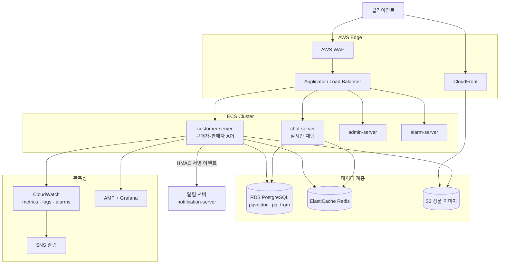
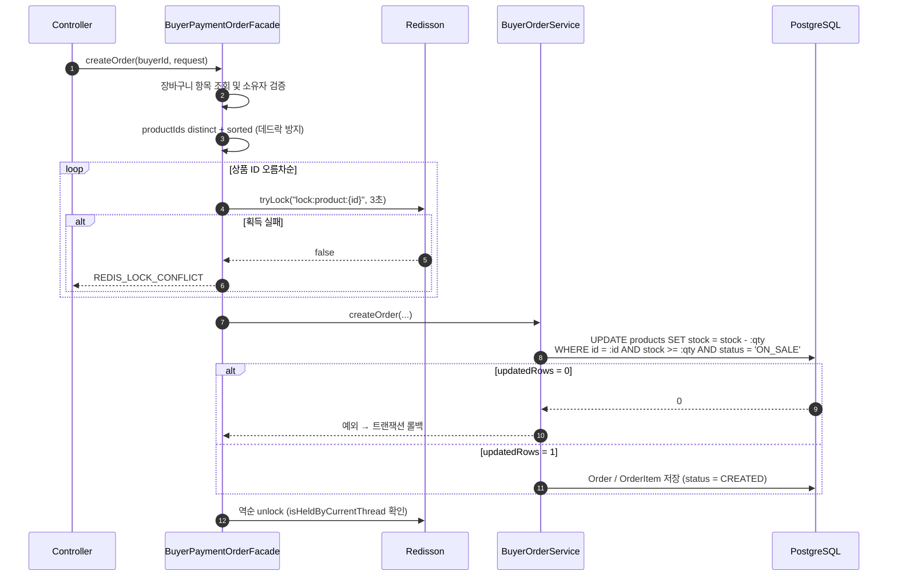
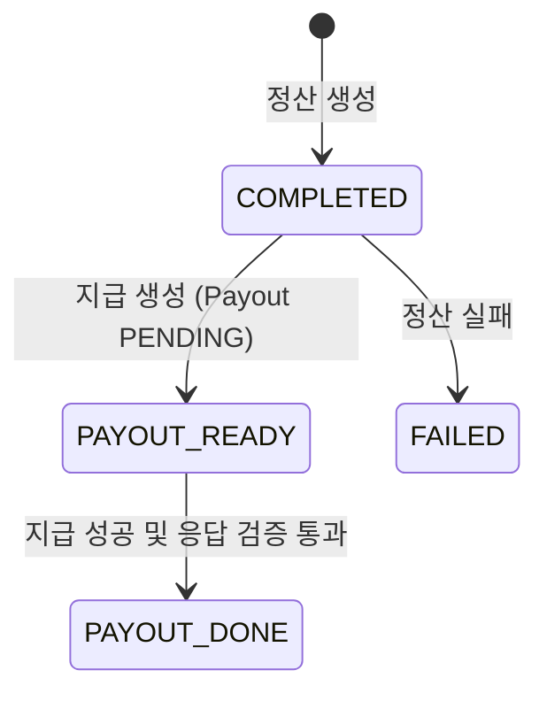

# all-in-market TRD (Technical Requirements Document)

> **문서 버전** v1.0 · **작성일** 2026-08-25 · **대상** `customer-server` (구매자/판매자 API 서버)
>
> 관련 문서: [PRD.md](./PRD.md) · [README.md](../README.md) · [CODE_CONVENTION.md](./rules/CODE_CONVENTION.md) · [GITHUB_RULES.md](./rules/GITHUB_RULES.md) · [technical-decisions.md](./technical-decisions.md) · [troubleshooting.md](./troubleshooting.md)
>
> 이 문서는 **코드에서 확인 가능한 사실**을 기준으로 작성했으며, 각 항목에 근거 파일 경로를 함께 표기한다. 측정 근거가 코드에 없는 성능 수치는 "README 기재 기준"으로 출처를 밝힌다.

---

## 1. 개요 및 아키텍처 원칙

### 1.1 문서 범위

[PRD.md](./PRD.md)가 정의한 요구사항을 **어떤 구조·제약·기술로 구현했는가**를 기술한다. 채팅·알림·챗봇 서버는 외부 연동 컴포넌트로만 다룬다.

### 1.2 패키지 경계 원칙

| 패키지 | 책임 | 규칙 |
|---|---|---|
| `com.example.allinmarket.domain.*` | JPA 엔티티, Spring Data/Querydsl 리포지토리, 도메인 enum/DTO | **비즈니스 로직을 두지 않는다.** 두 페르소나가 공유하는 영속성 모델 |
| `com.example.allinmarket.buyer.*` | 구매자 API의 controller / service / dto (필요 시 facade) | 기능별 하위 패키지(order, payment, cart, refund …) |
| `com.example.allinmarket.seller.*` | 판매자 API의 controller / service / dto | 기능별 하위 패키지(product, dashboard, settlement, payout …) |
| `com.example.allinmarket.common.*` | 횡단 관심사 — `config`, `security`, `outbox`, `response`, `redis`, `scheduler`, `exception`, `initializer` | 특정 페르소나에 종속되지 않는다 |

- 같은 레이어 간 상호 의존이 불가피할 때만 `facade`를 도입한다. 현재 유일한 사례는 `buyer/order/facade/BuyerPaymentOrderFacade`다.
- 클래스 네이밍·DTO(`record` + 정적 팩토리 `from`)·상수(`consts`)·enum(`enums`) 규칙은 [CODE_CONVENTION.md](./rules/CODE_CONVENTION.md)를 따른다.

---

## 2. 시스템 아키텍처



**근거** `infra/*.tf` — `customer_ecs_service.tf`, `chat_ecs_service.tf`, `admin_ecs_service.tf`, `alarm_ecs_service.tf`, `alb.tf`, `listener_rules.tf`, `rds.tf`, `elasticache.tf`, `s3.tf`, `cloudfront.tf`, `cloudwatch*.tf`, `observability_amp_grafana.tf`, `sns.tf`, `ecr.tf`, `github_oidc.tf`.

> WAF 정책은 README의 기술 의사결정에 기재된 운영 구성이며(5분 내 1,000회 초과 IP 차단), 이 리포지토리의 Terraform 코드에는 포함되어 있지 않다.

---

## 3. 기술 스택

| 영역 | 기술 | 버전/비고 |
|---|---|---|
| 언어/런타임 | Java | 21 (toolchain) |
| 프레임워크 | Spring Boot, Spring MVC, Spring Security | 4.0.5 |
| 영속성 | Spring Data JPA, Querydsl, PostgreSQL, Flyway | Querydsl 5.0.0 (jakarta), `ddl-auto: validate` |
| 캐시/락 | Spring Data Redis, Redisson | Redisson 4.3.0 |
| 인증 | jjwt | 0.12.6 |
| 재시도 | spring-retry | 2.0.9 |
| 파일 | AWS SDK S3 + CloudFront | 업로드 20MB / 요청 50MB |
| 관측성 | Actuator, Micrometer(CloudWatch, Prometheus) | `micrometer-registry-cloudwatch2`, `spring-cloud-aws` 4.0.0 |
| 문서 | Spring REST Docs, Asciidoctor | `bootJar` 시 `static/docs` 번들 |
| 테스트 | JUnit 5, Mockito, Testcontainers(PostgreSQL/Kafka), H2, spring-security-test | Testcontainers BOM 1.21.3 |
| 부하 테스트 | k6 | `k6/`, `docker-compose-k6.yml` |
| 더미 데이터 | datafaker | 2.0.2, `common/initializer/dummy` |

**Kafka 주의** `spring-boot-starter-kafka` 의존성이 있으나 `application.yaml`에서 `KafkaAutoConfiguration`을 **명시적으로 제외**하고 있다. 현재 이벤트 전달은 Kafka가 아니라 **DB outbox + 스케줄러 폴링 + HTTP 호출**로 구현되어 있다.

**근거** `build.gradle`, `src/main/resources/application.yaml`

---

## 4. 애플리케이션 레이어 구조

### 4.1 요청 처리 경로

```
HTTP 요청
  → LoginRateLimitFilter        (로그인 경로만 검사)
  → JwtAuthenticationFilter     (토큰 검증 · 블랙리스트 확인)
  → SecurityFilterChain 인가    (역할 기반)
  → Controller                  (@Valid 요청 DTO)
  → (Facade)                    (분산 락 등 조율이 필요할 때만)
  → Service                     (@Transactional 경계)
  → Repository                  (Spring Data / Querydsl)
  → ApiResponse<T> 응답
```

### 4.2 공통 응답 규약

`common/response/ApiResponse.java`

```json
{
  "success": true,
  "status": 200,
  "message": "데이터 조회에 성공하였습니다.",
  "data": { },
  "timestamp": "2026-08-25T10:00:00"
}
```

- 성공 메타데이터는 `SuccessEnum`(REGISTER/LOGIN/LOGOUT/TOKEN_REFRESHED/CREATE/READ/UPDATE/DELETE), 실패 메타데이터는 `ErrorEnum`에서 온다.
- 페이지 응답은 `PageResponse<T>`로 감싼다: `content`, `currentPage`(1-base), `totalPages`, `totalElements`, `size`, `isLast`.
- 도메인 예외는 `BaseException(ErrorEnum)`을 상속하고 `common/config/GlobalExceptionHandler`가 일괄 변환한다.

### 4.3 에러 코드 체계

`common/enums/ErrorEnum.java` — 공통(`INVALID_INPUT` 400, `UNAUTHORIZED` 401, `FORBIDDEN` 403, `NOT_FOUND` 404, `DATA_CONFLICT` 409, `INTERNAL_SERVER_ERROR` 500, `LOCK_ACQUISITION_FAILED`, `REDIS_UNAVAILABLE` 503)과 도메인별 코드(`ORDER_NOT_FOUND`, `ORDER_NOT_PAYABLE`, `ORDER_NOT_REFUNDABLE`, `CART_ITEMS_EMPTY`, `INVALID_CART_ITEM_OWNER`, `PRODUCT_NOT_FOUND`, `REDIS_LOCK_CONFLICT`, `LOGIN_RATE_LIMITED` …)를 한 enum에서 관리한다.

---

## 5. 데이터 모델

### 5.1 스키마 관리

- Flyway로 버전 관리한다(`src/main/resources/db/migration`, V1~V18). 운영 프로파일은 `ddl-auto: validate`이므로 **엔티티 변경은 반드시 migration을 동반**해야 한다.
- ERD: 

### 5.2 마이그레이션 이력

| 버전 | 내용 |
|---|---|
| V1 | 초기 스키마 — `buyers`, `sellers`, `addresses`, `categories`, `products`, `carts`, `cart_items`, `orders`, `order_items`, `payments`, `refunds`, `settlements`, `seller_daily_statistics`, `transaction_histories` |
| V2 | `seller_dashboard` (판매자·날짜 유니크) |
| V3 | `payments.merchant_uid` 추가 + 유니크 |
| V4 | `dashboard_outbox`, `history_outboxes` |
| V5 | 기본 배송지 부분 유니크 인덱스 |
| V6 | 결제 성공 부분 유니크 인덱스 |
| V7 | outbox 폴링 인덱스 |
| V8 | `payments.imp_uid` NOT NULL 해제 |
| V9 | pgvector 확장 + `langchain4j_embedding_store` |
| V10 | 정산/통계 중복 정리 + `uk_settlement_period` |
| V11 | `admins` |
| V12 | `restock_subscriptions` |
| V13 | `payouts` + `sellers.bank_code` |
| V14 | 채팅 4개 테이블(`realtime_chat_*`) |
| V15 | `restock_notifications` |
| V16 | `order_status_update_notifications` |
| V17 | `pg_trgm` 확장 + 트라이그램 GIN 인덱스 |
| V18 | `product_image` |

### 5.3 핵심 테이블

| 테이블 | 목적 | 핵심 제약/인덱스 |
|---|---|---|
| `buyers` / `sellers` | 회원 | `email` 유니크, `sellers.biz_number` 유니크, `status` CHECK, soft delete(`deleted_at`) |
| `products` | 상품 | `seller_id`, `category_id` FK, `status` CHECK(`ON_SALE`/`HIDDEN`), `stock` NOT NULL |
| `product_image` | 상품 이미지 | `sort_order >= 0` CHECK, `representative`, `idx_product_image_product_id` |
| `carts` / `cart_items` | 장바구니 | `carts.buyer_id` 유니크(구매자당 1개) |
| `orders` | 주문 | `status` CHECK(6종), `total_amount numeric(12,2)`, `tracking_number` nullable |
| `order_items` | 주문 상품 | **`seller_id` 보유** — 판매자별 분리·집계의 기준. 주문 시점 `product_name`/`unit_price` 스냅샷 |
| `payments` | 결제 | `imp_uid`·`merchant_uid` 유니크, `version`(낙관적 락), **`uq_payments_order_success`: `order_id` 부분 유니크 WHERE status='SUCCESS'** |
| `refunds` | 환불 | `payment_id` 유니크(결제당 1건), `version` |
| `addresses` | 배송지 | **`ux_address_default`: `buyer_id` 부분 유니크 WHERE is_default = true** |
| `seller_daily_statistics` | 일별 통계 | `uk_seller_stat_date` (seller_id, stat_date) |
| `seller_dashboard` | 대시보드 | `uk_seller_dashboard_date` (seller_id, stat_date) |
| `settlements` | 정산 | `uk_settlement_period` (seller_id, period_start, period_end), `type` CHECK(MID/END) |
| `payouts` | 지급 | `uk_payout_settlement_id`, `uk_payout_payout_key`(멱등), `retry_count`, `idx_payouts_status` |
| `dashboard_outbox` / `history_outboxes` | 트랜잭셔널 아웃박스 | `processed`, `retry_count`, 폴링 인덱스 `(processed, retry_count, id)` |
| `restock_subscriptions` | 재입고 구독 | `uk_restock_subscriptions_buyer` (user_id, product_id) |
| `restock_notifications` | 재입고 알림 이력 | `idx_restock_notifications_user_created_at (user_id, created_at DESC)` |
| `order_status_update_notifications` | 주문 상태 알림 이력 | `user_id`, `order_id` FK |
| `realtime_chat_*` | 채팅(외부 서버 사용) | 방 (buyer, seller) 유니크 + 자기 자신 방지 CHECK, 참여자 (room, user) 유니크, 메시지 커서 인덱스 `(room_id, id DESC)`, 읽음 상태 (room, user) 유니크 |
| `langchain4j_embedding_store` | 챗봇 RAG | `vector(1536)`, `metadata JSON`, 텍스트 GIN 트라이그램 인덱스 |

**설계 포인트 — 부분 유니크 인덱스**
애플리케이션 검증만으로는 동시성 상황에서 "주문당 성공 결제 1건", "구매자당 기본 배송지 1건"을 보장할 수 없다. 두 규칙 모두 조건부(WHERE) 유니크 인덱스로 **DB가 최종 보장**한다.

---

## 6. 인증 · 인가 설계

### 6.1 필터 체인

`common/config/SecurityConfig.java`

```java
.addFilterBefore(jwtAuthenticationFilter, UsernamePasswordAuthenticationFilter.class)
.addFilterBefore(loginRateLimitFilter, JwtAuthenticationFilter.class)
```

→ 실행 순서는 **LoginRateLimitFilter → JwtAuthenticationFilter**. 속도 제한을 인증 연산보다 앞에 두어 불필요한 BCrypt/DB 조회를 차단한다.

### 6.2 인가 규칙

| 경로 | 정책 |
|---|---|
| `/actuator/**` | `permitAll` — **알려진 제약**(§14) |
| `/auth/logout` | `authenticated` |
| `/auth/**` | `permitAll` |
| `/seller/auth/logout` | `hasRole("SELLER")` |
| `/seller/auth/**` | `permitAll` |
| `/products/**` | `permitAll` |
| `GET /categories` | `permitAll` |
| `/seller/**`, `/sellers/**` | `hasRole("SELLER")` |
| **그 외 전부** | `hasRole("BUYER")` |

> **운영상 함의**: 캐치올이 `hasRole("BUYER")`이므로 새 구매자 API는 별도 규칙 없이 보호된다. 반대로 **공개하거나 판매자 전용으로 만들 엔드포인트는 캐치올보다 위에 명시적으로 추가해야 한다.** 누락 시 조용히 구매자 전용이 된다.

세션은 `STATELESS`, CSRF는 비활성(토큰 기반).

판매자 승인 여부는 인가 규칙이 아니라 **로그인 시점**에 검사한다(`SellerAuthService`: `status != APPROVED`면 로그인 거부). 즉 미승인 판매자는 토큰 자체를 발급받지 못한다.

### 6.3 토큰 전략

| 항목 | 설계 |
|---|---|
| Access Token | JWT(jjwt), 기본 만료 1시간(`jwt.expiration`, 기본 3,600,000ms) |
| Refresh Token | Opaque UUID를 Redis(`refresh:{role}:{token}` → userId, TTL 7일)에 저장. **키에 role 세그먼트를 두어 구매자/판매자 키 공간을 분리한다**(`buyers`/`sellers`는 독립 시퀀스라 ID가 겹친다). 1회 사용 후 폐기(RTR). `getAndDelete`로 조회·삭제를 원자 처리 |
| 전달 방식 | Refresh Token은 응답 바디가 아닌 `HttpOnly` + `Secure` + `SameSite=Strict` 쿠키 |
| 로그아웃 | Access Token을 Redis 블랙리스트(`blacklist:{token}`)에 등록, TTL은 토큰 잔여 시간. 서비스 계층에서 role claim을 재검증한다 |
| 세션 제어 | `user_refreshes:{role}:{userId}` Set(TTL 7일)으로 발급 토큰을 추적해 멀티 디바이스 일괄 로그아웃 지원 |
| 장애 정책 | Redis 장애 시 **fail-closed** (인증 우회 대신 503) |

**근거** `common/security/JwtProvider.java`, `JwtAuthenticationFilter.java`, `buyer/auth/service`, `seller/auth/service`, README §5

### 6.4 로그인 속도 제한

`common/security/LoginRateLimitFilter.java`

| 항목 | 값 |
|---|---|
| 적용 경로 | `POST /auth/login`, `POST /seller/auth/login` |
| IP+이메일 | 5분 내 **5회** 실패 시 5분 차단 (`login:fail:ip-email:{ip}:{sha256(email)}`) |
| 이메일 단독 | 5분 내 **10회** 실패 시 5분 차단 (`login:fail:email:{sha256(email)}`) |
| 차단 시간 | `BLOCK_DURATION_SECONDS = 300` |
| 본문 크기 제한 | `MAX_BODY_BYTES = 8,192` 초과 시 차단 |
| 개인정보 | 이메일은 SHA-256 해싱 후 키로 사용 |
| 클라이언트 IP | `X-Forwarded-For`의 **마지막** IP를 신뢰(ALB 앞단 스푸핑 방지) |
| 응답 | 차단 시 `ErrorEnum.LOGIN_RATE_LIMITED` |

계정 열거 방지를 위해 로그인 실패 사유는 통일된 메시지로 응답하고, 존재하지 않는 계정에도 더미 BCrypt 연산을 수행해 응답 시간을 균등화한다(README §5).

### 6.5 서버 간 인증

외부 알림 서버 호출은 `common/security/HmacSigner`로 `timestamp + requestId + body`를 HMAC 서명하고, `notification.auth.client-id` / `notification.auth.secret`을 함께 전송한다.

---

## 7. 동시성 제어 설계

### 7.1 전략 매트릭스

| 지점 | 전략 | 근거 |
|---|---|---|
| 주문 생성 · 재고 차감 | **Redisson 분산 락 + DB 조건부 원자 UPDATE** | `BuyerPaymentOrderFacade`, `ProductRepository.decreaseStockIfEnough` |
| 결제 생성 | 주문 행 비관적 락(`PESSIMISTIC_WRITE`) + 결제 성공 부분 유니크 인덱스 | `OrderRepository.findByIdAndBuyerIdWithLock`, `uq_payments_order_success` |
| 결제/환불 상태 변경 | 낙관적 락(`@Version`) | `payments.version`, `refunds.version` |
| 환불 생성 | `payment_id` 유니크 제약 | `refunds_payment_id_key` |
| 정산 생성 | 기간 유니크 제약 + 위반 시 스킵 | `uk_settlement_period` |
| 지급 처리 | 비관적 락 + `payout_key` 멱등 | `PayoutRepository` `@Lock(PESSIMISTIC_WRITE)`, `uk_payout_payout_key` |
| Outbox 폴링 | 비관적 락으로 멀티 인스턴스 중복 처리 방지 | `DashboardOutboxRepository`, `HistoryOutboxRepository` `@Lock(PESSIMISTIC_WRITE)` |

### 7.2 재고 차감 경로 (핵심)



**설계 의도**
- Redis 락은 **경합을 앞단에서 줄이는 역할**, DB 조건부 UPDATE는 **최종 방어선**이다. 락을 우회하거나 Redis 장애가 발생해도 재고가 음수가 되지 않는다.
- 상품 ID를 정렬해 락을 획득하므로 서로 다른 주문 간 **락 순서 역전에 의한 데드락**이 발생하지 않는다.
- 락 해제는 `finally`에서 역순으로, `isHeldByCurrentThread()` 확인 후 수행한다.
- 상세 배경은 [technical-decisions.md](./technical-decisions.md) **TD-002** 참고.

### 7.3 미결제 주문 만료

`common/scheduler/OrderExpiryScheduler` — 60초 주기로 `CREATED` 상태이며 생성 후 30분 경과한 주문을 100건씩 페이지 단위로 조회해 `StockReleaseService.releaseStockAndFailOrder`로 재고 복구 + 주문 실패 처리한다. 건별 예외는 로깅 후 다음 건을 계속 처리한다.

---

## 8. 비동기 · 이벤트 설계

### 8.1 트랜잭셔널 아웃박스

결제/환불 트랜잭션 안에서 이벤트 행을 **같은 DB 트랜잭션으로** 저장하고, 스케줄러가 폴링해 후처리한다. 결제 응답 경로에서 무거운 집계를 제거하고, 대시보드 장애가 결제로 전파되지 않게 한다.

| Outbox | 용도 | 폴링 주기 | 재시도 |
|---|---|---|---|
| `dashboard_outbox` | 판매자 대시보드 갱신(`DASHBOARD_UPDATE`) | `DashboardOutboxScheduler` 60초 (`fixedDelay = 60000`) | `retry_count` 컬럼 기반 |
| `history_outboxes` | 거래 이력(`PAYMENT`/`REFUND`) 기록 | `HistoryOutboxScheduler` 300초 (`fixedDelay = 300_000`) | `HistoryOutBoxConsts.MAX_RETRY_COUNT = 3` |

- 미처리 행 조회는 `@Lock(PESSIMISTIC_WRITE)`로 잠가 **멀티 인스턴스 중복 처리**를 막는다.
- 폴링 쿼리는 `(processed, retry_count, id)` 인덱스를 사용한다(V7).
- 전달 보장 수준은 **at-least-once**이므로 소비 측은 멱등해야 한다.

### 8.2 스케줄러 목록

| 클래스 | 주기 | 역할 |
|---|---|---|
| `OrderExpiryScheduler` | `fixedDelay = 60초` | 30분 미결제 주문 만료 + 재고 복구 |
| `DashboardOutboxScheduler` | `fixedDelay = 60초` | 대시보드 아웃박스 처리 |
| `HistoryOutboxScheduler` | `fixedDelay = 300초` | 거래 이력 아웃박스 처리 |
| `DailyStatisticsScheduler` | `0 0 0 * * *` | 일별 판매 통계 생성 |
| `DashboardScheduler` | `0 0 0 * * *` | 일자 전환에 따른 대시보드 리셋 |
| `SettlementScheduler` | `0 20 0 16 * *` / `0 20 0 1 * *` | MID(당월 1~15일) / END(전월 16일~말일) 정산 생성 |
| `PayoutScheduler` | `0 0 2 1,16 * *` / `0 0 3 1,16 * *` | 지급 생성 / 지급 처리 |

### 8.3 외부 알림 서버 연동

`domain/restocksubscription/event/RestockEventListener`

```java
@Retryable(retryFor = RestClientException.class, maxAttempts = 4,
           backoff = @Backoff(multiplier = 2, random = true))
@TransactionalEventListener(phase = TransactionPhase.AFTER_COMMIT)
public void handleRestockEvent(RestockEvent event) { ... }
```

- `AFTER_COMMIT`이므로 **재고 변경이 실제로 커밋된 뒤에만** 알림이 나간다(롤백된 재고 변경으로 알림이 발송되지 않음).
- 전송 실패는 지수 백오프 + 지터로 최대 4회 재시도한다. 최종 실패해도 재고 변경은 유지된다.
- 요청은 `HmacSigner.sign(secret, timestamp + requestId + body)` 서명을 동반하며, 대상은 `notification-server.url`(prod: `https://hyu1335.cloud`)이다.

---

## 9. 캐시 전략

Redis를 단일 캐시 계층으로 사용한다(ECS 멀티 인스턴스에서 로컬 캐시는 정합성이 깨지므로).

| 대상 | 키 | TTL | 정책 |
|---|---|---|---|
| 상품 목록 | `products:search:{page}:{size}:{sort}` | 10분 | Cache Aside. **키워드 검색은 캐시하지 않으며, 10페이지 이상은 캐시 대상에서 제외** (`BuyerProductService`) |
| 정산 목록 | `settlement:{sellerId}:v{version}:{page}:{size}:{sort}` | 10분 | 버전 키(`settlement:version:{sellerId}`) 기반 무효화. **5페이지 이상은 DB 직접 조회** (`SellerSettlementService`) |
| 대시보드 | `dashboard:{sellerId}:{today}` | 5분 | 스케줄러/아웃박스가 사전 집계한 결과를 캐시 우선 조회. `POST /seller/dashboard/refresh`가 키를 삭제 후 재적재 (`SellerDashboardService`) |
| 로그인 실패 카운터 | `login:fail:ip-email:*`, `login:fail:email:*` | 300초 | §6.4 |
| 인증 | `blacklist:{token}` / `refresh:{role}:{token}` / `user_refreshes:{role}:{userId}` | 토큰 잔여 시간 / 7일 | §6.3 |
| 분산 락 | `lock:product:{productId}` | 대기 3초 | §7.2 |

**버전 키 무효화의 커밋 정합성**
정산 데이터 변경 후 버전 증가를 트랜잭션 내부에서 수행하면, 커밋 전에 다른 스레드가 새 버전 키로 **구버전 데이터를 캐싱**하는 문제가 생긴다. 이를 막기 위해 `TransactionSynchronizationManager.registerSynchronization`의 `afterCommit()` 훅에서만 버전을 증가시키고, 다수 판매자 버전 갱신은 Redis 파이프라이닝으로 일괄 처리한다(`SellerSettlementService`, README §6).

---

## 10. 정산 · 지급 파이프라인

### 10.1 정산 생성

`seller/settlement/service/SellerSettlementService.createSettlement`

1. 활성 판매자 전체를 한 번에 조회한다(`findAllActiveSellers`).
2. 기간 내 일별 통계를 `sumNetSalesGroupBySeller(periodStart, periodEnd)`로 **한 번의 group by 쿼리**로 집계한다(판매자별 N+1 회피).
3. 판매자별로 계산한다.
   - `fee = netSales × 0.05` (`SellerConsts.COMMISSION_RATE`, `RoundingMode.DOWN`, scale 2)
   - `settlementAmount = netSales − fee` (동일 반올림 정책)
4. `saveAndFlush`로 저장하며, `uk_settlement_period` 위반(`ConstraintViolationException`)은 **중복 정산으로 간주해 스킵**한다.
5. 성공한 판매자에 한해 커밋 이후 정산 캐시 버전을 증가시킨다.

기간 산정: MID는 `now.withDayOfMonth(1) ~ 15`, END는 `전월 16일 ~ 전월 말일`.

### 10.2 지급 파이프라인



- **생성**(`0 0 2 1,16 * *`): 지급이 아직 없는 정산을 배치로 조회해 `SellerPayoutProcessor.createSinglePayout()`으로 `Payout`을 만들고 정산을 `PAYOUT_READY`로 전환한다. `uk_payout_settlement_id`가 정산당 1건을 보장한다.
- **처리**(`0 0 3 1,16 * *`): `PENDING` 지급을 비관적 락(`FOR UPDATE`)으로 잠그고 `PROCESSING`으로 바꾼 뒤 뱅킹 게이트웨이를 호출한다. `payout_key`가 멱등 키다.
- **결과 처리**: 응답 검증 통과 시 `SUCCESS` + 정산 `PAYOUT_DONE`, 검증 실패 시 즉시 `FAILED`, 전송 실패 시 `retry_count`를 증가시키고 5회 이상이면 `FAILED`, 미만이면 `PROCESSING`을 유지해 다음 회차에 재시도한다(`SellerPayoutFailHandler`).

---

## 11. API 규약

- 베이스 경로 없이 루트에서 시작하며, 판매자 API는 `/seller/**`(기능) 및 `/sellers/me`(프로필)를 사용한다.
- 요청 DTO는 `XxxCreateRequest` / `XxxUpdateRequest`, 응답 DTO는 `XxxDetailResponse`(다건은 `List<XxxDetailResponse>`)로 통일한다.
- 검증은 DTO에서 `@NotNull` + 범위 애노테이션(`@PositiveOrZero`, `@Digits`), 문자열은 `@NotBlank`로 하고 엔티티가 `@Column(nullable, precision, scale)`로 같은 제약을 반영한다. 금액은 0을 허용한다(`@PositiveOrZero`).
- 목록 API는 `Pageable`을 받고 `PageResponse<T>`로 응답한다. **페이지 크기 상한은 현재 코드에 강제되어 있지 않다**(§14).

### 11.1 엔드포인트 요약

| 영역 | 엔드포인트 |
|---|---|
| 구매자 인증 | `POST /auth/signup`, `/auth/login`, `/auth/refresh`, `/auth/logout` |
| 구매자 프로필 | `GET`, `PUT` `/buyers/me` |
| 배송지 | `POST`, `GET` `/addresses` · `PUT`, `DELETE` `/addresses/{addressId}` |
| 상품/카테고리 | `GET /products`, `GET /products/{productId}`, `GET /categories` |
| 장바구니 | `POST /carts/items`, `GET /carts`, `PUT`·`DELETE` `/carts/items/{productId}` |
| 주문 | `POST /orders`, `GET /orders`, `GET /orders/{orderId}` |
| 결제 | `POST /payments`, `GET /payments`, `GET /payments/{paymentId}` |
| 환불 | `POST /orders/{orderId}/refunds`, `GET /refunds`, `GET /refunds/{refundId}` |
| 재입고 | `POST /restock-subscriptions`, `GET /restock-subscriptions/me`, `GET /restock-subscriptions/me/{productId}`, `DELETE /restock-subscriptions/{productId}`, `GET`·`PUT` `/restock-notifications/me`, `PUT /restock-notifications/{productId}` |
| 판매자 인증 | `POST /seller/auth/signup`, `/seller/auth/login`, `/seller/auth/refresh`, `/seller/auth/logout` |
| 판매자 프로필 | `GET`, `PUT` `/sellers/me` |
| 판매자 상품 | `POST`, `GET` `/seller/products` · `PUT`, `DELETE` `/seller/products/{productId}` · `PUT /seller/products/{productId}/stock` · `POST`, `GET` `/seller/products/{productId}/images` |
| 판매자 주문 | `GET /seller/orderitems` |
| 대시보드/통계 | `GET /seller/dashboard`, `POST /seller/dashboard/refresh`, `GET /seller/statistics/daily/{date}`, `GET /seller/statistics/summary` |
| 정산 | `GET /seller/settlements` |

### 11.2 API 문서 생성

- 컨트롤러 테스트가 REST Docs 스니펫(`build/generated-snippets`)을 생성한다.
- `docs/asciidoc/**`의 adoc이 스니펫을 포함하며, `asciidoctor` 태스크는 `test` 이후 실행된다.
- `bootJar`는 `asciidoctor`에 의존하므로 **jar 빌드 시 항상 전체 테스트가 재실행되고 문서가 `static/docs`로 번들된다.**

### 11.3 결제 플로우의 현재 한계

`POST /payments` 한 요청 안에서 결제 생성과 Mock PG 승인 확인을 함께 수행한다(`buyer/payment/client/MockPaymentGateway`). 실서비스의 생성 → 승인 → webhook 경계와 다르므로, 실 PG 연동 시 분리가 필요하다(§14).

---

## 12. 테스트 전략

| 계층 | 방식 | 비고 |
|---|---|---|
| 컨트롤러 | `@WebMvcTest` + `@AutoConfigureRestTestClient` + `RestTestClient`, 의존성은 `@MockitoBean` | **신규 테스트의 기본 패턴.** `@MockBean`은 제거됨. `RestDocsControllerTest`(MockMvc 기반)는 레거시로 두고 복제하지 않는다 |
| 서비스 | JUnit 5 + Mockito 단위 테스트 | 비즈니스 규칙 검증 |
| 동시성 | 다중 스레드 재고 차감 테스트 | `BuyerOrderConcurrencyTest` |
| 마이그레이션 | Testcontainers PostgreSQL | **이미지는 `pgvector/pgvector:pg16`** — V9의 `CREATE EXTENSION vector` 때문. [TD-001](./technical-decisions.md) / [TR-001](./troubleshooting.md) |
| 부하 | k6 시나리오 | `k6/scenario-a~f`, `scenario-chat.js`, `docker-compose-k6.yml` |

```bash
./gradlew test                                   # 전체 테스트
./gradlew test --tests "com.example...OrderServiceTest"
./gradlew asciidoctor                            # REST Docs 생성
docker compose -f docker-compose-k6.yml up --abort-on-container-exit
```

> 테스트 프로파일은 Flyway를 끄고 H2 `create-drop`을 사용하는 구성이 남아 있어, PostgreSQL 전용 기능(부분 인덱스, `pg_trgm`)은 마이그레이션 테스트에서만 검증된다(§14).

---

## 13. 배포 · 운영

### 13.1 프로파일과 환경 변수

`application.yaml`(공통) + `application-{local,dev,prod}.yml`

| 변수 | 용도 |
|---|---|
| `DB_HOST`, `DB_PORT`, `DB_NAME`, `DB_USERNAME`, `DB_PASSWORD` | PostgreSQL 접속 |
| `REDIS_HOST`, `REDIS_PORT` | Redis 접속 (prod는 SSL 활성) |
| `JWT_SECRET`, `JWT_EXPIRATION` | 토큰 서명/만료 |
| `SELLER_ID`, `SELLER_PASSWORD` | 초기 판매자 시드 |
| `CUSTOMER_SERVER`, `SERVER_SECRET_KEY` | 알림 서버 HMAC client-id / secret |
| `PRODUCT_IMAGE_BUCKET`, `PRODUCT_IMAGE_CDN_DOMAIN` | S3 버킷 / CloudFront 도메인 |
| `CLOUDWATCH_METRICS_ENABLED`, `CLOUDWATCH_METRICS_NAMESPACE` | 지표 내보내기 |
| `DDL_AUTO`, `SPRING_JPA_SHOW_SQL`, `HIBERNATE_FORMAT_SQL` | JPA 동작(운영 기본 `validate`) |
| `PGADMIN_EMAIL`, `PGADMIN_PASSWORD` | 로컬 도구 |

로컬 인프라는 `docker-compose.yml`(pgvector PostgreSQL, Redis, RedisInsight, pgAdmin)로 기동한다.

### 13.2 런타임 설정

- HikariCP `maximum-pool-size: 20`
- JDBC URL에 `reWriteBatchedInserts=true` (배치 INSERT 최적화)
- 가상 스레드 비활성(`spring.threads.virtual.enabled: false`)
- 멀티파트 업로드: 파일 20MB / 요청 50MB
- Tomcat MBean 레지스트리 활성(스레드풀 지표 수집용)

### 13.3 CI/CD

`.github/workflows/ci.yml`(빌드·테스트), `cd.yml`(ECR 푸시 → ECS 배포), `auto-assign.yml`, `harness-skill-check.yml`. AWS 자격증명은 GitHub OIDC(`infra/github_oidc.tf`, `github_actions_iam.tf`)로 가정한다. 브랜치·커밋·PR 규칙은 [GITHUB_RULES.md](./rules/GITHUB_RULES.md).

### 13.4 관측성

| 항목 | 설정 |
|---|---|
| Actuator 노출 | `health`, `info`, `metrics`, `prometheus` (`show-details: never`) |
| 공통 지표 태그 | `application`, `environment`, `service` |
| 지연 분포 | `http.server.requests` p95 + 히스토그램 |
| CloudWatch | 네임스페이스 `all-in-market/{env}/ApplicationMetrics`, step 60s |
| 대시보드/알람 | `infra/cloudwatch_dashboard.tf`, `cloudwatch_alarms_{ecs,rds,redis,alb_targets}.tf`, 로그 메트릭 필터, SNS 알림 |
| Grafana/Prometheus | `infra/observability_amp_grafana.tf`, `grafana_datasource.tf`, `infra-grafana/` |

---

## 14. 알려진 제약과 개선 로드맵

| 제약 | 영향 | 개선 방향 |
|---|---|---|
| `/actuator/**` 전체 `permitAll` (metrics·prometheus 포함) | 운영 지표 노출 위험 | health와 metrics/prometheus 접근 정책 분리, 또는 내부망/ALB 규칙으로 제한하고 근거 문서화 |
| 결제 생성과 Mock PG 승인이 같은 요청에서 수행 | 실 PG의 생성/승인/webhook 경계와 불일치 | confirm·webhook 분리 설계 후 실 PG 연동. 그전까지 Mock 플로우임을 API 문서에 명시 |
| 테스트 프로파일이 Flyway를 끄고 H2 사용 | PostgreSQL 부분 인덱스·`pg_trgm`·실제 migration이 대부분의 테스트에서 검증되지 않음 | Testcontainers PostgreSQL 통합 테스트 범위 확대 |
| 상품 검색이 `LIKE` 부분 일치 | 데이터 증가 시 풀스캔 위험 | products name/description 트라이그램 또는 전문 검색 인덱스 적용 후 `EXPLAIN ANALYZE` 전후 비교 문서화 |
| 페이지 크기 상한 미강제 | 대량 조회 요청으로 메모리·DB 부하 유발 가능 | 요청 `size` 상한 및 기본값 정책 도입 |
| Kafka 의존성이 남아 있으나 미사용 | 스택 오해 소지 | 사용 계획 확정 또는 의존성 제거 |
| 배송 상태 전이 API 부재 | `SHIPPED`/`DELIVERED`를 실제로 사용할 수 없음 | 판매자 주문 상태 변경 API 및 배송사 연동 설계 |
| 알림/채팅/챗봇이 외부 서버 | 계약 변경 시 동기화 비용 | 이벤트·인증 규약(HMAC 헤더, payload) 문서화 |

관련 기록: [technical-decisions.md](./technical-decisions.md) (TD-001, TD-002), [troubleshooting.md](./troubleshooting.md) (TR-001, TR-002).

---

## 15. 참고 문서

- 제품 요구사항: [PRD.md](./PRD.md)
- 코드 위치·작업 규칙(구현 가이드): [ARCHITECTURE.md](./ARCHITECTURE.md) · [API_REFERENCE.md](./API_REFERENCE.md) · [AUTH.md](./AUTH.md) · [PERSISTENCE.md](./PERSISTENCE.md)
- 코드 컨벤션: [rules/CODE_CONVENTION.md](./rules/CODE_CONVENTION.md)
- Git 워크플로: [rules/GITHUB_RULES.md](./rules/GITHUB_RULES.md)
- API 문서 소스: `docs/asciidoc/**`
- 인프라/CI 셋업 가이드: [INFRA_CICD_SETUP_GUIDE.md](../INFRA_CICD_SETUP_GUIDE.md)
